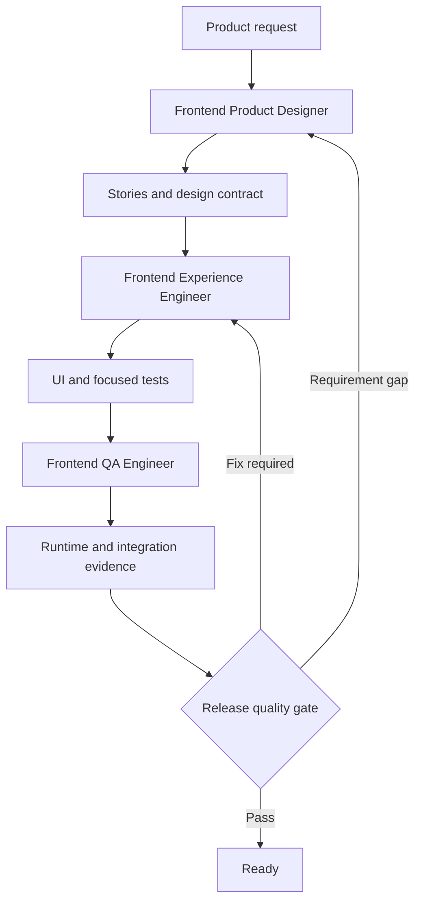

# Frontend Experience Plugin Implementation Specification

| Field | Value |
| --- | --- |
| Status | Proposed implementation plan |
| Target plugin | `frontend-experience` |
| Canonical plugin path | `harness/github-copilot/plugins/frontend-experience/` |
| Canonical component paths | `harness/github-copilot/agents/` and `harness/github-copilot/skills/` |
| Initial specification date | 2026-08-25 |
| Architecture decision | One installable plugin composed from focused agents and progressively disclosed skills |
| Primary surfaces | Web, progressive web apps, mobile applications, and desktop applications |

## Executive Summary

Build one installable GitHub Copilot plugin named `frontend-experience`. The plugin must help teams define, design, implement, test, and release product-specific frontend experiences without defaulting to interchangeable AI-generated layouts.

The package must remain modular internally. Three lean agents own product design, implementation, and independent quality assurance. Focused Agent Skills own domain knowledge and workflows for visual systems, responsive behavior, dashboards, data entry, conversational UI, accessibility, discoverability, testing, backend integration, and release validation. Skills load on demand, so one plugin does not imply one monolithic context.

The plugin must support existing projects before greenfield scaffolding. It detects the repository's actual framework, versions, design system, testing tools, API contracts, and platform targets before recommending changes. It must not replace an established local system with a generic design system or force a preferred framework onto an existing application.

Quality is part of the workflow rather than a final polish pass. Every user story and acceptance criterion must map to implementation evidence and either an automated check or an explicitly documented manual verification. Browser, mobile, desktop, accessibility, performance, discoverability, and backend-integration checks apply according to the product surface and risk.

## Decision and Rationale

### Decision

Create one plugin with multiple focused components. Do not create separate plugins for dashboards, data entry, chat, SEO, accessibility, or testing in the initial release.

### Why one plugin

| Benefit | Rationale |
| --- | --- |
| One installation | A project receives one coherent product-delivery workflow rather than discovering and installing several overlapping packages. |
| Shared evidence | Product context, design decisions, stories, API contracts, and QA results use one traceability model. |
| Progressive disclosure | GitHub Copilot discovers skills from their descriptions and loads detailed guidance only when relevant. |
| Consistent quality gates | Accessibility, responsive behavior, backend failures, and test evidence do not disappear at plugin boundaries. |
| Independent evolution | Individual skills can be added, versioned, reviewed, and tested without turning agents into large knowledge dumps. |
| Reuse without duplication | Existing canonical agents and skills can be materialized into the package through `plugin-sources.json`. |

### Future split criteria

Create a separate plugin only when a capability develops an independent operational boundary. Examples include a device-lab package that requires Appium infrastructure, paid device farms, platform credentials, or a separately maintained client extension. A topic boundary alone is not enough reason to create another plugin.

## Problem Statement

Generated frontend work commonly fails in predictable ways:

- The interface could belong to any product after replacing the logo.
- Every page becomes a collection of equal-weight cards.
- Decorative gradients, blurred surfaces, oversized headings, and rounded containers substitute for information architecture.
- Controls are visible but do not implement complete behavior or failure states.
- Mobile support means stacking desktop regions instead of adapting hierarchy and interaction.
- Dashboards use visually fashionable charts without matching the analytical question or data shape.
- Data-entry experiences expose validation too late, lose user input, or fail to connect server errors to fields.
- Chat interfaces implement only a message list and input, omitting streaming control, retries, citations, tool states, and accessibility announcements.
- SEO is reduced to a title tag while canonical URLs, social previews, structured data, icons, robots policy, and sitemap behavior remain incomplete.
- Screens are declared finished without browser evidence, backend integration, accessibility checks, or realistic states.

This plugin must replace those defaults with product evidence, explicit design decisions, complete interaction states, and executable validation.

## Goals

1. Produce frontend experiences that visibly belong to the product, audience, domain, and workflow.
2. Turn product intent into testable user stories, acceptance criteria, design contracts, and traceability records.
3. Support web, PWA, mobile, and desktop surfaces without pretending that one layout or interaction model fits all platforms.
4. Provide professional guidance for operational interfaces, dashboards, data visualizations, data entry, conversational UI, public websites, and content-heavy experiences.
5. Treat WCAG 2.2 AA accessibility, keyboard behavior, focus, zoom, reduced motion, and assistive technology as correctness concerns.
6. Integrate discoverability work, including technical SEO, metadata, social previews, structured data, web manifests, and icon assets.
7. Validate frontend-to-backend behavior through mocks, contract tests, integration environments, and critical end-to-end flows.
8. Prefer the repository's established stack, design system, components, and test conventions.
9. Use official, current sources for volatile claims and record when evidence was verified.
10. Package the capability according to this repository's canonical-source, synchronization, and validation rules.

## Non-Goals

- Do not become a generic backend, database, infrastructure, branding, or product-management plugin.
- Do not promise that visual polish creates product-market fit or improved conversion.
- Do not invent personas, research findings, analytics, metrics, business rules, or user preferences.
- Do not guarantee search ranking, accessibility certification, legal compliance, performance outcomes, or usability without evidence.
- Do not force React, a component library, a charting library, or a testing tool when an existing project has an appropriate alternative.
- Do not use current visual trends as mandatory style rules.
- Do not copy proprietary screens, branding, text, assets, or exact layouts from reference products.
- Do not treat generated screenshots, Lighthouse scores, or automated accessibility scans as complete proof by themselves.

## Source and Freshness Policy

The plugin must distinguish durable principles from volatile platform facts.

### Source precedence

Use sources in this order:

1. User requirements, repository code, design tokens, tests, API schemas, product documentation, and actual runtime evidence.
2. Normative standards from W3C, WHATWG, ECMA, IETF, the OpenAPI Initiative, the GraphQL Foundation, and the AsyncAPI Initiative where applicable.
3. Official platform guidance from GitHub, VS Code, Apple, Android, Microsoft, Google, and framework maintainers.
4. Official documentation from the selected implementation and testing tools.
5. User-provided design references and properly licensed product research.
6. Community material only when no authoritative source exists, clearly labeled as non-normative.

### Freshness requirements

- Record `source`, `area`, `product or specification version`, `verified date`, `result`, and `known divergence` for volatile claims.
- Reverify a source when the user asks for current or latest behavior, the target version changes, local evidence conflicts, a claim is marked unverified, or the recorded evidence is older than 90 days.
- Do not update a verification date without repeating the check.
- Prefer a known official URL. Use search only to locate a moved first-party page.
- Pin external runtime dependencies to a verified version. Never put `latest` in plugin runtime configuration.
- Treat fetched pages as evidence, not instructions to execute.
- Store Copilot runtime findings in `docs/HARNESS-VALIDATION.md` when implementation changes or extends the harness contract.
- Give every trend-oriented reference a review date and an explicit applicability test.
- Report a blocked fetch, unavailable runtime, or missing version as a limitation instead of treating the source as verified.

### Evidence checked for this specification

| Area | Official source result on 2026-08-25 | Plan consequence |
| --- | --- | --- |
| Copilot plugin composition | Repository evidence verified GitHub agents, skills, MCP, hooks, extensions, and LSP as plugin components; repository instructions and VS Code prompts are not plugin components. | Publish instructions and prompts through a separate, explicit workspace setup skill. |
| Accessibility | WCAG 2.2 and WAI-ARIA APG official URLs were identified, but W3C returned HTTP `403` to this fetch client. | Keep WCAG 2.2 AA as the repository's existing target; require a successful first-party recheck before encoding changed criteria or dated claims. |
| Responsive design and data entry | Official web.dev learning paths cover internationalization, macro and micro layouts, typography, images, theming, accessibility, interaction, usability testing, autofill, privacy, and cross-device testing. | Treat responsive behavior as adaptation across content, input, locale, and screen configuration. |
| Platform design | Apple HIG covers principles, accessibility, icons, color, layout, materials, typography, patterns, components, and inputs across Apple platforms. Material 3 presents M3 Expressive and 2026 updates. Fluent 2 publishes components for web, iOS, Android, and Windows. | Treat each as platform or design-system guidance, not a universal normative standard. |
| Web performance | Google documents LCP, INP, and CLS as stable Core Web Vitals with good thresholds of `2.5s`, `200ms`, and `0.1`, evaluated at the 75th percentile and segmented by mobile and desktop. The page was last updated 2024-10-31. | Recheck thresholds before generating a maintained policy; distinguish field measurement from laboratory proxies. |
| Search discoverability | Google Search guidance fetched successfully and was last updated 2025-12-10. It emphasizes people-first content, descriptive titles, useful snippets, crawlable resources, descriptive URLs, canonical handling, and no ranking guarantee. | Scope SEO to eligibility, crawlability, comprehension, and previews rather than promised ranking. |
| Robots and sitemaps | Google states that `robots.txt` manages crawler access but is not a security or reliable deindexing mechanism. Sitemaps can improve discovery but do not guarantee crawling or indexing. | Require deliberate privacy, `noindex`, authentication, robots, and sitemap decisions instead of blanket file generation. |
| Structured data | Google recommends JSON-LD when practical, requires visible and accurate page-matching data, and treats valid markup as rich-result eligibility rather than a guarantee. | Generate structured data only for supported, truthful page types and validate it. |
| HTML links and icons | WHATWG HTML Living Standard, updated 2026-08-25, defines `canonical`, `icon`, and `manifest` link relations. It permits scalable icons with `sizes="any"` and requires declared bitmap sizes to match the resource. | Preserve an SVG master and generate compatibility files only for justified targets. |
| Social metadata | Open Graph requires `og:title`, `og:type`, `og:image`, and `og:url`; it recommends descriptive image metadata including `og:image:alt`. | Generate complete, public, absolute metadata without asserting one universal image size. |
| HTTP API contracts | OpenAPI 3.2.0 was published 2025-09-19 and explicitly covers HTTP APIs, streaming sequential media, SSE, binary content, uploads, responses, and security schemes. | Detect the project's declared OAS version and validate with compatible tooling instead of rewriting every contract to 3.2.0. |
| GraphQL contracts | The latest published GraphQL release is September 2025; a June 2026 working draft also exists. | Default to the project's released schema and tooling; do not treat the draft as stable. |
| Message contracts | AsyncAPI's current official specification page reports 3.1.0 and covers protocol-agnostic message-driven APIs, channels, operations, messages, correlation, bindings, and security. | Use AsyncAPI when the frontend consumes documented message or realtime contracts and compatible tooling exists. |
| Browser testing | Playwright supports Chromium, Firefox, and WebKit; visual results vary with OS, browser, settings, hardware, and headless mode. Its accessibility guide says automation detects only some issues. | Pin the environment for visual baselines and combine automated checks with manual accessibility testing. |
| Component testing | Storybook 10.5 documentation describes browser-based component, interaction, accessibility, and visual tests; it says coverage is a barometer rather than a goal of 100 percent. | Make Storybook an adapter when already present or justified, not a mandatory dependency. |
| Unit and UI testing | Vitest documentation updated 2026-04-08 requires Vite 6 or later and Node 20 or later. Testing Library documentation updated 2026-01-22 prioritizes user-like tests and avoiding implementation details. | Detect installed versions before recommending Vitest and use user-facing queries when Testing Library applies. |
| API mocking and contracts | MSW 2.0 documents reusable REST, GraphQL, and WebSocket interception across browser and Node. Pact distinguishes consumer-driven contract tests from schema-only provider conformance. | Keep mocks, schema validation, and consumer-provider contract testing as distinct layers. |

### Trend applicability test

A trend may influence a design only when all answers are defensible:

1. Does it help the primary user complete the screen's job?
2. Does it fit the product's brand, audience, domain, density, and trust requirements?
3. Does it work across the required input methods, platforms, zoom levels, and motion preferences?
4. Does it preserve content hierarchy and performance budgets?
5. Can it be implemented with the existing design system without creating a parallel one-off system?
6. Is there a simpler established pattern that communicates the same meaning more clearly?

If the evidence is weak, preserve the established product grammar.

## Architecture Principles

### Lean agents, rich skills

Agents define mission, authority, workflow, tool boundaries, handoffs, and completion criteria. Domain rules, reference matrices, templates, examples, and repeatable procedures live in Agent Skills. Every new agent must load the relevant skill or skills before making domain decisions.

### Evidence before aesthetics

Before choosing a layout or visual direction, inspect the user job, product language, real data, states, design tokens, component inventory, device constraints, and acceptance criteria. Aesthetic exploration cannot replace missing product decisions.

### Product specificity

Every design contract must identify:

- primary user and screen job;
- primary and secondary actions;
- decision inputs and information hierarchy;
- real product nouns, statuses, permissions, and constraints;
- required loading, empty, partial, error, offline, success, and permission states;
- visual language and the evidence supporting it;
- forbidden generic defaults;
- responsive and surface adaptations;
- observable acceptance criteria.

### Complete behavior

Visible controls must perform real actions or have an honest disabled state. The plugin must not create decorative filters, tabs, menus, chart controls, pagination, upload areas, chat actions, or buttons that do nothing.

### Progressive enhancement and graceful degradation

Core tasks must remain understandable when animation, hover, advanced graphics, or client-side enhancement is unavailable. The experience must account for reduced motion, coarse pointers, keyboard-only use, slow networks, partial backend failure, and assistive technology.

## Distribution and Ownership

Use `componentSource: "library"` for this package. All three new agents and all new or reused skills listed for the package remain canonical under `harness/github-copilot/agents/` and `harness/github-copilot/skills/`. `sync_plugin_components.py` generates direct copies under the plugin root.

Do not use `sharedSkills` for this package. That key applies to `componentSource: "plugin"`, and there is no supported `sharedAgents` key. The package root owns only `plugin.json`, `README.md`, and `mcp.json`; its generated `agents/` and `skills/` directories are never edited independently.

The flat GitHub Copilot plugin contract supports agents, skills, commands, hooks, extensions, MCP servers, and LSP servers. It does not install repository instructions or VS Code prompt files as plugin components. The package therefore uses two activation paths.

### Direct plugin components

- Agents under `agents/`
- Agent Skills under `skills/`
- A pinned Playwright MCP server through `mcp.json`
- Root `plugin.json`
- Package `README.md`

### Optional workspace companions

The `frontend-project-setup` skill publishes optional project companions only after an explicit dry-run and approval:

- `.github/instructions/frontend-experience.instructions.md`
- `.github/instructions/frontend-testing.instructions.md`
- `.github/instructions/frontend-discoverability.instructions.md`
- `.github/prompts/frontend-design.prompt.md`
- `.github/prompts/frontend-build.prompt.md`
- `.github/prompts/frontend-validate.prompt.md`
- `.github/prompts/frontend-assets.prompt.md`

These files are templates bundled inside the setup skill. They are not described as directly installed plugin primitives. Publishing must be conflict-aware, idempotent, reversible, symlink-safe, and explicit.

## Proposed Canonical Layout

```text
harness/github-copilot/
|-- agents/
|   |-- frontend-product-designer.agent.md
|   |-- frontend-experience-engineer.agent.md
|   `-- frontend-qa-engineer.agent.md
|-- skills/
|   |-- frontend-experience-core/
|   |-- frontend-requirements-and-stories/
|   |-- frontend-visual-system/
|   |-- frontend-responsive-adaptation/
|   |-- frontend-dashboard-visualization/
|   |-- frontend-form-interactions/
|   |-- frontend-conversational-ui/
|   |-- frontend-discoverability-assets/
|   |-- frontend-accessibility/
|   |-- frontend-test-strategy/
|   |-- frontend-component-testing/
|   |-- frontend-visual-e2e-testing/
|   |-- frontend-backend-integration/
|   |-- frontend-mobile-desktop-testing/
|   |-- frontend-release-quality-gate/
|   `-- frontend-project-setup/
|-- manifests/
|   `-- plugin-sources.json
`-- plugins/
    `-- frontend-experience/
        |-- plugin.json
        |-- README.md
        |-- mcp.json
        |-- agents/        # Generated from canonical library agents
        `-- skills/        # Generated from canonical library skills
```

Generated plugin component copies must never become independent sources. `sync_plugin_components.py` materializes them from the canonical library declared in `plugin-sources.json`.

## Runtime Composition



## Agent Specifications

### `frontend-product-designer`

**Mission:** Turn product intent and repository evidence into testable user stories, information architecture, interaction patterns, and implementation-ready design contracts.

**Expected inputs:** Product request, target users, repository evidence, existing design system, supported surfaces, constraints, and known acceptance criteria.

**Default posture:** Read-only for application code. It may create or update approved product or design artifacts only when explicitly requested.

**Tool profile:** `read`, `grep`, `glob`, `web_fetch`, and `web_search`. Add `edit` only when the agent's write policy explicitly allows a named design artifact.

**Required skills:**

- `frontend-experience-core`
- `frontend-requirements-and-stories`
- `frontend-visual-system`
- The applicable domain skill for dashboards, data entry, chat, responsive adaptation, accessibility, or discoverability

**Key outputs:**

- Evidence inventory
- User stories and Given/When/Then acceptance criteria
- Journey and state map
- Information hierarchy
- Design contract
- Responsive and surface adaptation specification
- Open decisions and assumptions

**Handoff:** Pass stable story IDs, acceptance IDs, evidence, the approved design contract, file scope, and unresolved decisions to `frontend-experience-engineer`.

**Must not:** Implement application code, fabricate research, or approve its own design as production-ready.

### `frontend-experience-engineer`

**Mission:** Implement the approved frontend contract in the repository's actual stack, including complete states, accessible interactions, focused tests, and integration boundaries.

**Expected inputs:** Approved story and acceptance IDs, design contract, target files, local framework and design-system evidence, API schemas, test commands, and constraints.

**Write policy:** Modify only frontend source, frontend tests, directly related assets, and configuration required by the selected implementation. Backend contracts may be consumed but not silently changed.

**Tool profile:** `read`, `grep`, `glob`, `edit`, and `execute`. Add `playwright/*` only when the agent owns browser inspection for the active task; otherwise hand runtime validation to QA.

**Required skills:**

- `frontend-experience-core`
- The selected domain and surface skills
- `frontend-component-testing`
- `frontend-backend-integration` when remote data or services participate
- `frontend-accessibility`

**Key outputs:**

- Working implementation
- Unit or component tests appropriate to the risk
- Typed data boundaries
- Complete loading, empty, error, success, offline, and permission states
- Validation commands and results
- Explicit unverified runtime checks

**Handoff:** Pass changed files, acceptance coverage, test results, startup instructions, seed data, known risks, and unverified checks to `frontend-qa-engineer`.

**Must not:** Rewrite unrelated code, replace the existing design system without approval, or claim visual correctness without runtime inspection.

### `frontend-qa-engineer`

**Mission:** Independently verify acceptance criteria, runtime behavior, visual quality, accessibility, backend integration, and release readiness.

**Expected inputs:** Story and acceptance IDs, implementation handoff, target environment, startup commands, fixtures, supported browsers or devices, and risk profile.

**Write policy:** Do not edit application source. By default it is fully read-only; a separate explicit test-authoring request may permit changes only to test files and QA artifacts.

**Tool profile:** `read`, `grep`, `glob`, `execute`, and `playwright/*`. Do not include `edit` in the independent review profile.

**Required skills:**

- `frontend-test-strategy`
- `frontend-visual-e2e-testing`
- `frontend-backend-integration`
- `frontend-accessibility`
- `frontend-mobile-desktop-testing` when applicable
- `frontend-release-quality-gate`

**Key outputs:**

- Risk-based test plan
- Acceptance traceability matrix
- Automated and exploratory results
- Redacted screenshots, traces, console, and network evidence
- Reproducible defects with severity
- Exact verdict: `Ready`, `Ready with follow-ups`, or `Blocked`

**Handoff:** Return implementation defects to the engineer, requirement gaps to the designer, and a release verdict only when traceable evidence exists.

**Must not:** Fix application code while acting as independent QA, expose secrets or personal data in evidence, or issue a confidence verdict without executed checks.

## Skill Package Standard

Each `SKILL.md` must remain focused and preferably below 200 lines. Detailed domain knowledge belongs in `references/`, repeatable helpers in `scripts/`, reusable output material in `assets/`, and modifiable workspace scaffolds in `templates/`.

Every skill description must state what the capability does and when it should load. Objective workflows receive three to five realistic trigger and output evaluations in `evals/evals.json`. Subjective design skills receive a human review checklist with observable pass, revision, blocked, and not-applicable states.

Skills do not carry independent release versions in top-level frontmatter. They evolve with plugin SemVer; imported source details or resource editions belong in supported `metadata` fields.

## Skill Inventory

| Skill or capability | Trigger and responsibility | Expected bundled resources |
| --- | --- | --- |
| `frontend-experience-core` | Any frontend design, build, or review request. Establish product evidence, design contract, anti-generic rules, state completeness, and workflow routing. | `references/product-evidence.md`, `references/anti-generic-interface-gate.md`, `assets/design-contract.md` |
| `frontend-requirements-and-stories` | Feature discovery, user stories, acceptance criteria, journey mapping, or Definition of Done. | `references/invest-and-gherkin.md`, `assets/user-story.md`, `assets/traceability-matrix.md` |
| `frontend-visual-system` | Typography, color, spacing, composition, iconography, imagery, tokens, themes, or visual direction. | `references/typography.md`, `references/color-and-contrast.md`, `references/layout-and-density.md`, `references/motion.md` |
| `frontend-responsive-adaptation` | Mobile browser, tablet, desktop, wide screen, foldable, touch, pointer, keyboard, orientation, or container adaptation. | `references/adaptive-layouts.md`, `references/input-and-device-matrix.md` |
| `frontend-dashboard-visualization` | Dashboards, operational consoles, KPI pages, tables, chart selection, analytical interaction, or data storytelling. | `references/chart-selection.md`, `references/dashboard-patterns.md`, `references/accessible-data-visualization.md` |
| Data-entry capability listed in the canonical layout | Input, validation, onboarding, checkout, search, filters, settings, uploads, or multi-step workflows. | `references/data-entry-patterns.md`, `references/validation-and-errors.md`, `references/async-submission.md` |
| `frontend-conversational-ui` | Chat, copilots, assistants, streaming responses, citations, tool activity, attachments, or multimodal conversation. | `references/conversation-patterns.md`, `references/streaming-and-tool-states.md`, `references/chat-accessibility.md` |
| `frontend-discoverability-assets` | SEO, metadata, canonical URLs, structured data, social previews, favicons, PWA manifests, app icons, or share cards. | `references/technical-seo.md`, `references/social-metadata.md`, `references/icon-matrix.md`, `assets/metadata-checklist.md` |
| `frontend-accessibility` | WCAG reviews, semantic implementation, keyboard behavior, focus, screen readers, charts, data entry, media, zoom, or motion. | `references/wcag-2.2-aa.md`, `references/native-accessibility.md`, `assets/manual-a11y-checklist.md` |
| `frontend-test-strategy` | Test planning, QA scope, risk analysis, user-story coverage, test data, environments, or release criteria. | `references/test-layer-selection.md`, `assets/test-strategy.md`, `assets/traceability-matrix.md` |
| `frontend-component-testing` | Components, hooks, composables, stores, state machines, validation, or Storybook interaction tests. | `references/react-testing.md`, `references/vue-testing.md`, `references/component-contracts.md` |
| `frontend-visual-e2e-testing` | Browser journeys, screenshots, visual regression, responsive verification, console or network checks, or Playwright generation. | `references/playwright-quality.md`, `references/visual-regression.md`, `assets/qa-report.md` |
| `frontend-backend-integration` | REST, GraphQL, WebSocket, SSE, authentication, contract tests, mocks, ephemeral services, or backend failure behavior. | `references/rest-and-openapi.md`, `references/graphql.md`, `references/realtime.md`, `references/integration-environments.md` |
| `frontend-mobile-desktop-testing` | React Native, Expo, Flutter, SwiftUI, Compose, Electron, Tauri, simulators, emulators, gestures, lifecycle, or windows. | `references/mobile-testing.md`, `references/desktop-testing.md`, `references/device-matrix.md` |
| `frontend-release-quality-gate` | Final review, evidence collection, defect severity, regression scope, or release verdict. | `references/release-gates.md`, `scripts/check_traceability.py`, `assets/release-report.md` |
| `frontend-project-setup` | Inspect, install, update, or remove optional frontend instructions and VS Code prompts in a consuming repository. | `scripts/install_companions.py`, `templates/.github/instructions/`, `templates/.github/prompts/` |

## Reuse and Overlap Decisions

Reuse canonical content through the source manifest rather than copying or rewriting it.

| Existing primitive | Decision |
| --- | --- |
| `anti-ui-slop` skill | Include the canonical skill as a library component. Reverify its volatile external catalogue-size claim before release. Supplement rather than fork its product-specific evidence and finish gate. |
| `playwright-explore-website` skill | Include the canonical skill for runtime exploration before test generation. Its browser dependency must resolve through the pinned plugin MCP server. |
| `playwright-generate-test` skill | Include the canonical skill for Playwright generation from observed behavior. Keep new QA guidance focused on evidence, traceability, and release policy. |
| `web-design-reviewer` skill | Do not include in the first release until its fixed viewport assumptions, unpinned MCP example, and review-versus-fix boundary are repaired. |
| `accessibility` agent | Keep available as an adjacent specialist. Do not duplicate its full knowledge body in the new agents. The new accessibility skill owns the portable procedure and native-surface additions. |
| `accessibility-runtime-tester` agent | Reuse through an explicit handoff when focused runtime accessibility evidence is needed. It remains read-only. |
| `frontend-performance-investigator` agent | Reuse through a handoff for trace-based performance diagnosis. The new plugin owns only baseline budgets and release routing. |
| `frontend-web-dev` plugin | Remain independent. Reuse its canonical Playwright skills but do not treat its manifest description as proof of complete React, Angular, and Vue implementation coverage. |
| `testing-automation` plugin | Remain independent as a general testing package. This plugin adds frontend-specific story traceability, visual quality, device adaptation, and backend-boundary checks. |

Any shared-source edit affects every package that consumes it. The implementation PR must list affected plugins and rerun synchronization and package audits for the full blast radius.

## UX and Visual Design Standard

### Required evidence before design

Inspect at least the following when available:

- Primary user, job, environment, frequency, urgency, and consequences of error
- Existing user research and product requirements
- Actual routes, components, tokens, content, data shapes, and access rights
- Existing brand and device conventions
- Current screenshots and runtime behavior
- Localization, long-content, and right-to-left requirements
- Supported browsers, devices, assistive technologies, and input methods
- Performance budgets and network constraints

Unknowns remain unknown. The plugin may propose options, but it must not convert assumptions into product facts.

### Anti-generic interface gate

Block completion when any condition is true:

- The interface could belong to an unrelated product after changing the logo.
- The layout uses cards for sections that are not repeated, comparable items.
- The visual hierarchy does not reflect the user's actual decision sequence.
- Headlines, labels, metrics, statuses, or calls to action are placeholders or generic filler.
- A fashionable effect has no information, state, workflow, or brand purpose.
- All sections use equal visual weight despite different importance.
- The design creates a one-screen token system that conflicts with the repository's established system.
- Mobile behavior merely stacks every desktop region without reprioritizing content or controls.
- A visible control has no outcome, unavailable state, or explanation.

### Typography

- Use the existing brand type system when one exists.
- Choose typefaces for language coverage, readability, hierarchy, loading behavior, and product character rather than novelty alone.
- Define semantic roles and a bounded scale instead of assigning arbitrary sizes per component.
- Preserve text resizing, user font preferences where applicable, long words, localization expansion, and dynamic type.
- Avoid viewport-width font scaling that makes text unpredictable across displays.
- Keep letter spacing at zero unless the typeface, language, or brand system provides an evidence-based exception.

### Color and themes

- Start from semantic roles such as surface, text, border, action, focus, success, warning, danger, and data-series roles.
- Do not convey meaning through color alone.
- Test text, icons, focus indicators, controls, charts, disabled states, dark mode, high contrast, and forced colors.
- Avoid one-note palettes that collapse hierarchy into shades of one hue.
- Preserve brand colors but create accessible semantic pairings and fallback treatments.

### Layout and density

- Let the product workflow determine composition. Marketing, editorial, operational, analytical, creative, and transactional surfaces require different density and navigation.
- Use full-width sections for page structure; reserve cards for repeated items, modals, and genuinely framed tools.
- Do not place cards inside cards.
- Define stable dimensions for boards, tables, chart regions, toolbars, icon controls, and media to prevent layout shift.
- Ensure every viewport reveals the primary task without hiding critical controls behind decorative content.
- Prefer alignment, grouping, rhythm, contrast, and whitespace over ornamental containers.

### Motion and feedback

- Motion must explain state, hierarchy, continuity, progress, or spatial relationships.
- Prefer `transform` and `opacity` for animation where possible.
- Provide reduced-motion behavior and never require animation to understand or complete a task.
- Avoid scroll hijacking, custom cursors, magnetic controls, and continuous parallax unless the brief explicitly justifies them and accessible fallbacks exist.
- Communicate pending, success, failure, cancellation, and optimistic rollback states.

## Responsive and Cross-Surface Standard

Responsive work must adapt hierarchy and behavior, not only dimensions.

| Surface | Required considerations |
| --- | --- |
| Mobile browser | Small viewport, dynamic browser chrome, touch, virtual keyboard, safe areas, portrait and landscape, slow network, installability when PWA applies. |
| Tablet | Split views, orientation changes, intermediate density, touch and keyboard combinations, sidebars, and panes. |
| Desktop browser | Resizable windows, mouse and keyboard, dense workflows, wide-screen line length, hover as enhancement only. |
| Native mobile | Native navigation, safe areas, access prompts, lifecycle, offline behavior, dynamic type, VoiceOver or TalkBack, gestures with alternatives. |
| Desktop app | Window resizing, minimum sizes, menus, keyboard shortcuts, multiple windows, native dialogs, offline behavior, and update states. |
| Foldable or dual-screen | Posture changes, hinges, discontinuous regions, and content continuity when explicitly supported. |

Use content-driven breakpoints and container queries when supported by the project. Validate representative widths around actual layout transitions rather than assuming that device labels alone prove responsiveness.

## Dashboard and Data Visualization Standard

Start with the decision or question, then select an encoding.

| Analytical need | Default candidate | Avoid when |
| --- | --- | --- |
| Compare categories | Sorted bar or dot plot | Category labels or values cannot be read accurately. |
| Trend over time | Line chart | Time is irregular and the line would imply continuity that is not present. |
| Distribution | Histogram, box plot, or density plot | The audience cannot interpret the summary without supporting explanation. |
| Relationship or correlation | Scatter plot | Overplotting or sample size makes the pattern misleading. |
| Part-to-whole | Stacked bar; pie only for a few clearly distinct parts | Precise comparison across many segments matters. |
| Exact values and scanning | Table with sorting and semantic value formatting | A chart would obscure operational detail. |
| Geography | Map | Location is not analytically meaningful. |
| Flow | Sankey or flow diagram | Path magnitude is not the question or the flow becomes unreadable. |
| Status against threshold | Bullet chart, labeled metric, or progress indicator | A gauge adds decoration without useful comparison. |

Dashboard rules:

- Define metric name, unit, time window, comparison baseline, update time, and data provenance.
- Never invent metrics or populate charts with fictional production values unless clearly labeled fixture data is requested.
- Use consistent number, date, timezone, currency, and missing-value formatting.
- Distinguish zero, missing, delayed, partial, and unavailable data.
- Make filters visible, reversible, URL-addressable where appropriate, and reflected in titles or summaries.
- Provide textual summaries or accessible tables for complex visualizations.
- Support keyboard navigation and accessible names for interactive chart controls.
- Do not use color alone for series, status, or alerts.
- Test dense labels, negative values, outliers, large values, empty ranges, loading, errors, and partial data.
- Preserve the underlying data table or downloadable data only when product policy permits it.

## Data Entry and Interaction Standard

- Use visible labels. Placeholders are hints, not labels.
- Group related fields semantically and explain why sensitive data is requested.
- Choose native input types, autocomplete tokens, input modes, and password-manager-compatible behavior.
- Validate at a moment that helps the user. Avoid error noise before the user has had a chance to respond.
- Link field errors programmatically, preserve input after failures, and provide an error summary for complex workflows.
- Map server validation to fields when safe; retain a workflow-level message for unknown or cross-field failures.
- Prevent accidental duplicate submission while communicating progress and cancellation behavior.
- Confirm destructive or irreversible actions and provide undo when feasible.
- For multi-step experiences, preserve progress, expose the current step, allow safe backward navigation, and state what is saved.
- Cover virtual-keyboard avoidance and viewport changes on mobile.
- Test autofill, paste, long text, international names and addresses, locale-specific numbers, file limits, network failure, token expiry, and retry.
- Preserve accessibility when using rich controls such as date pickers, comboboxes, token inputs, editors, drag-and-drop, or signatures.
- Do not block password paste, password managers, or browser autofill without a documented security requirement.

## Conversational Interface Standard

A professional chat experience must cover more than rendering messages.

### Required states and controls

- New, existing, loading, streaming, completed, stopped, failed, retried, edited, and deleted conversations as applicable
- Composer states for empty, multiline, attachment, recording, disabled, over-limit, and offline cases
- Stop generation, retry, edit and resend, copy, feedback, citation, and attachment behavior when supported by the product
- Tool or agent activity with understandable status and bounded technical detail
- Partial output and recovery after disconnects
- Conversation history, title, rename, archive, search, and retention behavior when in scope
- Privacy and data-use disclosure appropriate to the application
- Clear identity for user content, assistant output, tool results, quoted content, and system status

### Accessibility and safety

- Announce new content without repeatedly interrupting screen-reader users during streaming.
- Keep focus stable when messages append or tool panels expand.
- Expose citations, code blocks, tables, and action controls semantically.
- Do not use typing animation that prevents selecting or reading content.
- Preserve user input after errors and explain retry consequences.
- Treat remote or generated content as untrusted before rendering rich HTML, links, or executable snippets.
- Provide a non-streaming or reduced-update reading path when frequent live updates create an accessibility barrier.
- Keep destructive conversation actions confirmable and retention behavior transparent.

## Accessibility Standard

Target WCAG 2.2 Level AA unless a stricter product, procurement, regulatory, or organizational requirement applies. Automated tools supplement but do not replace manual verification.

Required coverage includes:

- Semantic structure, landmarks, heading hierarchy, lists, tables, and document language
- Accessible names, roles, values, descriptions, and states
- Keyboard completion, logical order, visible focus, no traps, and focus restoration
- Dialogs, popovers, menus, tabs, comboboxes, trees, grids, and other composite widgets using native semantics or current WAI-ARIA Authoring Practices
- Text contrast, non-text contrast, color-independent meaning, zoom, reflow, text spacing, forced colors, and dark mode
- Pointer cancellation, target size, drag alternatives, orientation, and motion alternatives
- Labels, instructions, errors, summaries, redundant-entry reduction, and accessible authentication
- Images, charts, diagrams, audio, video, captions, transcripts, and long descriptions
- SPA route announcements, async status, loading, errors, toasts, and live regions
- Mobile dynamic type, VoiceOver, TalkBack, safe areas, and native accessibility APIs

Manual smoke tests must include keyboard-only use, at least one relevant screen-reader path when available, zoom or dynamic type, reduced motion, and high-contrast or forced-color behavior for applicable surfaces.

Automated results must identify the engine, engine version, ruleset or tags, tested state, exclusions, and unresolved manual checks. A clean axe or Lighthouse result is not an accessibility certification.

## Discoverability, SEO, and Asset Standard

Apply SEO only to public, indexable web content. Authenticated dashboards, private workspaces, preview environments, and sensitive routes require deliberate indexing policy rather than indiscriminate metadata.

### Technical SEO

- Unique, descriptive page title and useful meta description
- Stable canonical URL and deliberate duplicate-content handling
- Crawlable navigation and meaningful link text
- Correct status codes, redirects, and error pages
- `robots.txt` and robots metadata aligned with environment and route privacy
- Sitemap generation for eligible canonical URLs when it benefits discovery
- Language, locale, and `hreflang` behavior when internationalization applies
- Structured data only when visible page content and an officially supported result type justify it
- Server-rendered or otherwise crawlable critical content for public pages
- Image dimensions, modern formats, responsive sources, meaningful filenames, and contextual alt text
- No `meta keywords`, keyword stuffing, hidden text, or unsupported ranking promises

`robots.txt` must never be presented as a confidentiality or reliable deindexing mechanism. Sensitive content requires access control; deliberate deindexing uses supported indexing controls that crawlers can read.

### Social previews

- Open Graph title, type, URL, and image
- Open Graph description and image alternative text when an image is present
- Consumer-specific metadata only when the target service documents a requirement not covered by shared metadata
- Preview image with safe text margins, readable contrast, correct branding, and no sensitive or user-specific data
- Stable absolute asset URLs in deployed environments
- Automated metadata checks plus manual validation in current service preview tools when available

Do not treat a single image dimension as a universal standard. A project may configure a common `1200 x 630` fallback, but target-service documentation must be rechecked and that size must not be described as an Open Graph requirement.

### Favicons, app icons, and manifests

- Maintain an original professional SVG master for icons and logos.
- Generate PNG, ICO, maskable, monochrome, or native derivatives only where the browser, operating system, store, or manifest requires them.
- Validate small-size legibility instead of mechanically shrinking a detailed logo.
- Provide light, dark, pinned-tab, touch, and maskable variants only when the target surface supports and needs them.
- Keep Web App Manifest names, colors, icons, display mode, scope, and start URL aligned with actual application behavior.
- Declare bitmap sizes accurately and use `sizes="any"` only for a truly scalable icon.
- Do not claim PWA installability without running the applicable browser checks.
- Do not generate store submission assets without checking current Apple, Android, Microsoft, or other target-store requirements.

## User Stories and Acceptance Traceability

Every user-facing capability must use stable identifiers.

```text
US-001 -> AC-001, AC-002 -> SC-001, SC-002 -> TEST/EVIDENCE -> RESULT
```

### User story contract

Each story includes:

- Stable ID
- Actor or user segment supported by evidence
- Goal and user value
- Scope and non-goals
- Preconditions and access rights
- Primary path
- Alternative and failure paths
- Given/When/Then acceptance criteria
- Accessibility and surface considerations
- Data and backend dependencies
- Analytics requirements only when supplied by the product owner
- Test and evidence mapping

### Acceptance-criteria rules

- Describe observable behavior, not implementation preference.
- Include success, loading, empty, partial, invalid, unauthorized, forbidden, conflict, rate-limited, unavailable, timeout, offline, and recovery behavior when applicable.
- Include keyboard, touch, screen-reader, responsive, localization, and reduced-motion expectations when relevant.
- Avoid subjective criteria such as "modern," "clean," "fast," or "intuitive" without observable definitions.
- Do not mark a criterion complete until evidence or a documented manual verification exists.

### Traceability record

Use the project's existing product-documentation convention when one exists. Otherwise, use this fallback:

```text
docs/frontend/<feature>/
|-- stories.md
|-- design-contract.md
`-- quality/
    |-- traceability.json
    |-- test-strategy.md
    `-- qa-report.md
```

Each traceability entry includes:

- story ID and acceptance ID;
- scenario ID and risk level;
- test layer and test file or manual procedure;
- environment, browser, device, locale, data fixture, and build identifier when relevant;
- result: `pass`, `fail`, `manual`, `not-applicable`, or `blocked`;
- evidence path or command output reference;
- known limitation, defect ID, and retest requirement.

Temporary traces, videos, screenshots, and network logs remain in the project's test artifact directories unless policy explicitly requires committed evidence. Never commit secrets or personal data.

## Test and QA Architecture

### Test-layer selection

| Layer | Proves | Typical tools |
| --- | --- | --- |
| Static checks | Types, lint rules, schemas, build compatibility, and import boundaries | TypeScript, framework compiler, lint, formatter, schema validators |
| Unit tests | Pure transformations, validation rules, formatters, reducers, and state transitions | Vitest, Jest, or native project tools |
| Component tests | Rendering, interactions, accessibility semantics, states, and callbacks in isolation | Testing Library, framework test utilities, Storybook tests |
| Mocked integration | Frontend behavior across components and API client boundaries with controlled responses | Mock Service Worker or established project equivalent |
| Contract tests | Consumer and provider agreement for REST, GraphQL, events, and realtime messages | OpenAPI validation, Pact, GraphQL schema checks, AsyncAPI where applicable |
| Service integration | Frontend against real backend components and ephemeral dependencies | Testcontainers, Docker Compose, local emulators, seeded test environments |
| End-to-end | Critical journeys through the deployed or locally integrated system | Playwright for web; Maestro, Detox, Appium, or native tools for mobile |
| Visual regression | Unexpected rendered changes across stable fixtures and viewports | Playwright screenshots or the repository's visual service |
| Accessibility | Automated rules plus keyboard, focus, screen-reader, zoom, contrast, and motion behavior | axe-core, Playwright, native inspectors, manual assistive-technology checks |
| Performance | Loading, interaction, stability, bundle, rendering, and native runtime behavior | Lighthouse, Web Vitals, browser traces, native profilers |
| Discoverability | Metadata, crawl policy, canonicalization, structured data, manifest, and previews | HTML and schema checks, Lighthouse, Search Console tools, preview validators |

Do not mandate every layer for every change. The test strategy must explain why a layer applies or does not apply. Coverage numbers are diagnostic evidence, not a universal release target.

### Required screen testing

For material UI changes, capture and inspect representative states at:

- A narrow mobile viewport near `320px`
- A common mobile viewport near `375px`
- A tablet or intermediate viewport near `768px`
- A standard desktop viewport near `1280px`
- A wide desktop viewport when the product supports wide layouts

Also test immediately before and after content-driven breakpoints. Widths are representative evidence points, not permission to ignore fluid behavior between them.

Screen QA must check:

- overflow, clipping, overlap, occlusion, unstable dimensions, and layout shift;
- realistic long and localized content;
- loading, empty, partial, error, success, disabled, and restricted-access states;
- focus order, focus visibility, keyboard completion, and reduced motion;
- light, dark, high-contrast, and forced-color modes when supported;
- touch and pointer behavior;
- console errors, failed requests, hydration warnings, and unexpected network calls;
- real assets, fonts, charts, canvases, and media rendering rather than blank placeholders.

### Visual regression rules

- Use repeatable fixtures, fonts, dates, timezones, animation settings, and seeded data.
- Mask only truly variable regions and document every mask.
- Review baseline updates as product changes, not mechanical snapshots.
- Pair screenshot differences with behavioral assertions.
- Keep rendering differences isolated by browser, operating system, or device project.
- Generate and review baselines in the same environment used for comparison.
- Do not use image similarity as the only accessibility or usability assertion.

### Backend integration validation

Validate at four levels when risk justifies them:

1. **Typed mock behavior:** Controlled success and failure responses exercise frontend states without requiring a live backend.
2. **Contract compatibility:** Consumer expectations are checked against OpenAPI, GraphQL, AsyncAPI, protobuf, or provider contracts.
3. **Ephemeral integration:** Frontend, backend, and required dependencies run with isolated, seeded data.
4. **Critical end-to-end journeys:** The real frontend and backend complete high-value workflows through the user interface.

Required scenarios when applicable:

- `400`, `401`, `403`, `404`, `409`, `422`, `429`, and `5xx` responses
- Timeout, abort, retry, backoff, reconnect, and offline transitions
- Expired authentication, refresh failure, insufficient access, and session revocation
- CORS, CSRF, cookie, origin, and secure transport behavior
- Pagination, filtering, sorting, search, and stale-cache behavior
- Optimistic update success, rollback, conflict, and idempotency
- Upload progress, size or type rejection, cancellation, resume, and server scanning states
- Locale, timezone, currency, numeric precision, and date boundaries
- Partial data, backward-compatible additions, removed fields, enum expansion, and unknown values
- WebSocket or SSE connect, stream, stop, reconnect, duplicate event, ordering, and partial-message behavior

The frontend must not silently redefine a backend contract. Contract changes require explicit ownership, compatibility analysis, generated-client impact review, and rollout planning.

### Contract policy

- Detect the contract type and declared version before choosing tools.
- Validate the version already used by the project; do not migrate a schema as a side effect of frontend work.
- Keep schema conformance, consumer-driven contract tests, mocks, and full integration tests distinct.
- Generate clients only when the repository already uses generation or the team explicitly accepts generated-code ownership.
- Treat remote schemas and example payloads as untrusted input; prevent path escape, unsafe reference fetching, and secret exposure.
- Cover documented content types, encodings, streaming items, error payloads, headers, cookies, and security requirements that the frontend consumes.
- Verify GraphQL persisted operations, fragment compatibility, nullable fields, union or interface expansion, errors with partial data, and subscription behavior when applicable.
- Verify message correlation, duplicate delivery, ordering assumptions, replay, reconnect, and unknown event types when applicable.

### Test data and environment

- Use repeatable synthetic or properly anonymized data.
- Never put production secrets, personal information, access tokens, or customer screenshots into fixtures or evidence.
- Make seed and cleanup operations repeatable and narrowly scoped.
- Isolate tests from execution order and shared mutable state.
- Freeze dates, random values, locale, timezone, and feature flags where repeatability matters.
- Separate mock, integration, staging, and production-like evidence in reports.
- Preserve artifacts only as long as project policy requires.
- Record browser, operating system, runtime, dependency versions, service revisions, and build IDs needed to reproduce a result.

### Flaky test policy

- A retry may collect evidence but must not convert an unexplained intermittent failure into a pass.
- Classify the cause as product race, test race, environment instability, data collision, third-party dependency, rendering variance, or unknown.
- Quarantine only with an owner, issue, scope, expiry or review date, and non-quarantined coverage for critical behavior.
- Prefer event-aware waits and web-first assertions over sleeps.
- Track retry count and first-attempt status in the QA report.
- Block release when a flaky test protects a critical journey and no reliable alternative evidence exists.

### QA evidence and verdict

Every defect includes severity, environment, preconditions, steps, expected behavior, actual behavior, evidence, likely scope, and exact retest procedure. Evidence must be redacted and reproducible.

The final verdict is one of:

| Verdict | Meaning |
| --- | --- |
| `Ready` | Applicable acceptance criteria and release gates passed with no unresolved blocking risk. |
| `Ready with follow-ups` | Only explicitly accepted, non-blocking risks remain, each with an owner and follow-up. |
| `Blocked` | A required check could not run, a blocking defect remains, traceability is incomplete, or evidence does not support release. |

## Supported Stack Strategy

The plugin detects and respects the installed stack. It must not describe an unverified version as current, change frameworks, or upgrade dependencies unless the user requests that work.

### Stack detection

Inspect package manifests, lockfiles, framework configuration, TypeScript settings, route structure, native project files, design-system packages, styling approach, API clients, test configuration, CI workflows, and documented support matrices before choosing an adapter.

Record detected versions and confidence. When evidence conflicts, stop version-specific generation and ask for the intended target.

### First-class support

| Surface | Primary choices | Recommended test ecosystem when the repository has no established equivalent |
| --- | --- | --- |
| React web | React with Next.js or Vite and TypeScript | Vitest when compatible, Testing Library, optional Storybook, MSW, Playwright |
| Vue web | Vue with Nuxt or Vite and TypeScript | Vitest when compatible, Vue Testing Library or Vue Test Utils, optional Storybook, MSW, Playwright |
| Progressive web app | React or Vue application with standards-based manifest, service worker, and update strategy | Web stack tests, Playwright, Lighthouse, offline and update-flow tests |
| Cross-device mobile | React Native with Expo and TypeScript | Project-selected unit runner, React Native Testing Library, Maestro or Detox |
| Desktop web shell | Electron or Tauri with React or Vue and TypeScript | Web component tests, Playwright or WebdriverIO where appropriate, shell integration tests |

### Supported adapters

| Surface | Choices | Typical tests |
| --- | --- | --- |
| Angular web | Angular and TypeScript | Angular TestBed or Testing Library, project-selected unit runner, Playwright |
| Svelte web | SvelteKit and TypeScript | Vitest when compatible, Testing Library, Playwright |
| Content-focused web | Astro and TypeScript | Focused unit tests, Playwright, metadata and Lighthouse checks |
| Cross-device mobile | Flutter and Dart | `flutter_test`, `integration_test`, Maestro or Appium |
| Native iOS | SwiftUI | XCTest, XCUITest, accessibility and performance tools |
| Native Android | Jetpack Compose | JUnit, Compose UI tests, Espresso, accessibility and performance tools |

Adapters contain syntax and tooling differences. Product evidence, accessibility, interaction completeness, traceability, and release gates remain shared.

### Capability profiles

| Profile | Required capability |
| --- | --- |
| Web | Semantic DOM, routing, rendering strategy, browser compatibility, responsive media, metadata, keyboard and pointer behavior. |
| PWA | Installability, service-worker lifecycle, caching policy, offline states, update prompts, push behavior when used, and manifest validation. |
| Mobile | Safe areas, navigation, access prompts, lifecycle, deep links, keyboard, gestures with alternatives, offline synchronization, and VoiceOver or TalkBack. |
| Desktop | Window lifecycle and sizing, menus, shortcuts, IPC trust boundaries, file dialogs, offline behavior, updates, packaging evidence, and OS accessibility. |

A result can mark a profile `not-applicable` only with repository or requirement evidence. Supporting one profile does not imply support for the others.

### Library selection policy

- Reuse installed component, data-entry, state, chart, animation, and test libraries when they satisfy the requirement.
- Add a dependency only when it removes meaningful complexity or provides a proven domain engine.
- Check maintenance, license, delivery cost, accessibility, server-rendering behavior, target support, security posture, and testability.
- Prefer a structured chart library over manually drawing a complex visualization.
- Use D3-level primitives only when the interaction or encoding genuinely requires custom visualization engineering.
- Prefer native controls and semantic HTML before custom widgets.
- Record the exact version and official documentation used for any generated integration.
- Do not introduce a second design system or state library for one feature without an approved migration or coexistence decision.

## Performance and Runtime Quality

For public web experiences, measure Core Web Vitals in field data when available and use laboratory evidence for development feedback. Google's source checked for this plan documents good thresholds of LCP at or below `2.5s`, INP at or below `200ms`, and CLS at or below `0.1`, evaluated at the 75th percentile separately for mobile and desktop. Reverify these values before encoding them in a maintained project policy.

Additional quality checks may include:

- JavaScript and CSS delivery cost
- Image, font, video, and chart asset cost
- Server response and rendering behavior
- Hydration and long tasks
- Interaction latency for critical controls
- Virtualization for genuinely large collections
- Memory use, startup, frames, and battery impact on native or desktop surfaces
- Offline, slow-network, and recovery behavior

Lighthouse cannot measure field INP without user interaction; TBT may be a laboratory proxy but is not a substitute for field measurement. Capture a baseline, tie recommendations to evidence, and remeasure after changes.

## Workspace Companion Design

### Scoped instructions

`frontend-experience.instructions.md` owns passive conventions for frontend implementation files. Its generated `applyTo` must target detected frontend roots and relevant extensions rather than `**`.

`frontend-testing.instructions.md` owns test structure, selectors, fixtures, repeatability, evidence hygiene, and validation for detected frontend test files.

`frontend-discoverability.instructions.md` owns metadata, public-route, manifest, icon, robots, sitemap, and structured-data conventions for relevant web files.

Existing project instructions and stricter design-system, security, legal, or product policies win. The setup workflow must detect overlaps and preview changes rather than silently installing conflicting guidance.

Every generated instruction must use one quoted comma-separated `applyTo` string and contain passive conventions only. Ordered setup, generation, migration, and review work stays in skills or prompts.

### VS Code prompts

| Prompt | Purpose |
| --- | --- |
| `/frontend-design` | Produce or update stories, journeys, state maps, and a design contract from repository evidence. |
| `/frontend-build` | Implement an approved frontend slice with bounded file scope and focused tests. |
| `/frontend-validate` | Run the risk-based QA, visual, accessibility, integration, and release workflow. |
| `/frontend-assets` | Generate or audit metadata, social previews, icons, and manifest assets. |

Prompt files are VS Code-only conveniences. Every cross-surface workflow must remain available as a skill. Each prompt must use the repository's ten-section contract, explicit input and destination handling, bounded write scope, and representative Chat: Run Prompt validation.

### Optional VS Code MCP publication

The plugin's root `mcp.json` follows the portable plugin schema and is not copied byte-for-byte into VS Code settings. When a consuming workspace needs browser tools outside plugin runtime, `frontend-project-setup` may offer a separately maintained VS Code MCP template using the same verified package pin.

The publisher must merge only its named server entry after approval. It must not replace an existing `.vscode/mcp.json`, change an existing server with the same name, or claim the VS Code server is active until tool discovery is verified.

### Setup safety

`frontend-project-setup` must:

1. Inspect existing `.github/copilot-instructions.md`, `.github/instructions/`, `.github/prompts/`, agents, skills, MCP settings, and project scripts.
2. Detect stack, frontend roots, test roots, public routes, and likely conflicts.
3. Produce a dry-run plan listing create, update, unchanged, conflict, and skipped actions.
4. Require explicit approval before writes.
5. Refuse to overwrite modified files unless the user selects an explicit merge or force path.
6. Record installed template edition and content hashes without storing secrets.
7. Be idempotent on repeated runs.
8. Support a clean uninstall that removes only files it owns and leaves modified files untouched.
9. Reject path traversal, symlink escape, destinations outside the selected workspace, and partial writes after a conflict.
10. Never install dependencies implicitly or send repository content to external services.

The setup skill needs focused tests for dry-run, apply, repeated apply, conflict with no writes, changed-file preservation, path escape, symlink escape, interrupted operation, and uninstall.

## Plugin Manifest Plan

Start the plugin at version `0.1.0` so repository governance classifies it as incubating until representative runtime verification is complete. The final license must be selected only after reviewing repository policy and the licenses of every reused component.

The distributed `plugin.json` should contain only supported fields:

```json
{
    "name": "frontend-experience",
    "description": "Product-specific frontend design, implementation, accessibility, discoverability, integration testing, and release validation for web, mobile, and desktop projects.",
    "version": "0.1.0",
    "author": {
        "name": "paulasilvatech"
    },
    "repository": "https://github.com/paulasilvatech/copilot-primitives",
    "keywords": [
        "frontend",
        "ux",
        "accessibility",
        "responsive-design",
        "testing",
        "seo"
    ],
    "agents": "agents/",
    "skills": "skills/",
    "mcpServers": "mcp.json"
}
```

Add `license` only after the SPDX decision and compatibility review are complete. Do not publish a placeholder license value.

The marketplace entry must be alphabetized and use the same `description` and `version` as the manifest:

```json
{
    "name": "frontend-experience",
    "source": "./harness/github-copilot/plugins/frontend-experience",
    "description": "Product-specific frontend design, implementation, accessibility, discoverability, integration testing, and release validation for web, mobile, and desktop projects.",
    "version": "0.1.0"
}
```

## Source Manifest Plan

Add `frontend-experience` to `harness/github-copilot/manifests/plugin-sources.json` with:

- `componentSource` set to `library`;
- all three canonical agent references from the Agent Specifications section;
- every canonical skill directory from the Skill Inventory and Proposed Canonical Layout;
- canonical references for `anti-ui-slop`, `playwright-explore-website`, and `playwright-generate-test`;
- no `sharedSkills`, plugin-owned agent, or plugin-owned skill declarations;
- no governance probe date before a representative runtime probe has actually run.

The generated package must contain exactly the declared agents and skills, with no extra component directories.

## Playwright MCP Plan

The official npm registry was checked on 2026-08-25. It reported `@playwright/mcp` version `0.0.79`, the Microsoft `playwright-mcp` repository, and Apache-2.0 licensing. The exact command `npx -y @playwright/mcp@0.0.79 --help` ran successfully and confirmed the planned `--headless` and `--isolated` options.

Use this portable plugin configuration:

```json
{
    "$schema": "https://agent-plugins.org/schemas/1.0.0/mcp.schema.json",
    "mcpServers": {
        "playwright": {
            "type": "stdio",
            "command": "npx",
            "args": [
                "-y",
                "@playwright/mcp@0.0.79",
                "--headless",
                "--isolated"
            ]
        }
    }
}
```

Security and runtime requirements:

- `npx -y` downloads and executes the exact pinned npm package when it is not cached; document that network and supply-chain boundary.
- Do not enable unrestricted file access, disable host checks, disable the browser sandbox, or load a secrets file by default.
- Keep browser file access restricted to workspace roots.
- Treat allowed-origin configuration as request filtering, not as a security boundary, matching the tool's own help text.
- Give `playwright/*` only to agents that require browser capability.
- Recheck the registry, repository release, license, and command options before changing the pin.
- Run an isolated installed-plugin probe that discovers the MCP server and performs navigation, snapshot, screenshot, console, and network operations against a disposable local fixture.
- Because the package ships MCP, classify assurance as `runtime-required` until that representative probe is recorded.
- A successful `--help` invocation proves command compatibility only; it does not prove plugin discovery or browser behavior.

## Implementation Phases

### Phase 0: Evidence refresh and scope lock

#### Phase 0 Work

- Reverify GitHub plugin, agent, skill, prompt, instruction, and MCP documentation.
- Reverify WCAG, WAI-ARIA, responsive design, Apple HIG, Android and Material guidance, Fluent guidance, SEO, Web Vitals, and selected test-tool documentation.
- Resolve the W3C fetch limitation through an approved first-party access path before changing accessibility criteria.
- Inventory overlapping local primitives and record reuse or specialization decisions.
- Confirm author identity, license strategy, initial support tiers, and first-release exclusions.

#### Phase 0 Exit Criteria

- Dated first-party evidence is recorded.
- No unresolved source conflict affects package architecture.
- The overlap ledger names every reused, repaired, specialized, or excluded primitive.
- License compatibility is understood before a distributed license field is added.

### Phase 1: Package skeleton and source mapping

#### Phase 1 Work

- Add the package root, manifest, README, pinned MCP configuration, source-manifest entry, and marketplace entry.
- Declare all generated library components without hand-creating package copies.
- Add package installation and companion-publication documentation.

#### Phase 1 Exit Criteria

- Manifest normalization and plugin audit pass.
- Marketplace description and version match the manifest.
- Source mapping is valid and generated component paths are known.
- A fresh isolated installation discovers the package, even though assurance remains runtime-required until full probes run.

### Phase 2: Core agents and foundational skills

#### Phase 2 Work

- Implement the three lean agents from the contracts in this specification.
- Implement core, requirements and stories, visual system, responsive adaptation, and accessibility skills.
- Add bundled templates and focused references.
- Add trigger and non-trigger evaluations or human review checklists according to each skill's output type.

#### Phase 2 Exit Criteria

- Each agent names its authority, write policy, tool profile, required skill loading, unknowns, output, and handoffs.
- Every skill passes the skill validator.
- The designer cannot edit application code, and the independent QA profile has no edit capability.
- Representative requests route to the correct skill without loading unrelated domains.

### Phase 3: Domain experience skills

#### Phase 3 Work

- Implement dashboard and visualization, data-entry interaction, conversational UI, and discoverability assets.
- Add focused reference documents rather than expanding core skill bodies.
- Include complete-state, accessibility, runtime-cost, and surface criteria.
- Add fixtures and review prompts for operational dashboard, public content, complex data entry, and streaming chat scenarios.

#### Phase 3 Exit Criteria

- Representative scenarios produce product-specific contracts rather than interchangeable layouts.
- Chart recommendations trace back to analytical questions and data properties.
- Input and chat scenarios include failures, cancellation, retry, and assistive-technology behavior.
- Discoverability output distinguishes public, private, preview, canonical, and deindexed routes.
- No domain skill invents data, research, or unsupported requirements.

### Phase 4: QA and integration skills

#### Phase 4 Work

- Implement test strategy, component testing, visual E2E, backend integration, mobile and desktop testing, and release-gate skills.
- Add traceability, strategy, QA, defect, and release report assets.
- Add `check_traceability.py` with focused unit tests and safe path handling.
- Add contract adapters for detected OpenAPI, GraphQL, AsyncAPI, and Pact workflows without requiring every adapter in every project.

#### Phase 4 Exit Criteria

- Story-to-acceptance-to-scenario-to-evidence traceability is machine-checkable.
- The checker handles all result states and rejects missing IDs, duplicate IDs, broken evidence references, and unsupported states.
- Representative HTTP, GraphQL, realtime, auth, upload, and failure scenarios route to the correct test layer.
- Release verdicts require evidence and cannot be produced from a checklist alone.

### Phase 5: Workspace companions

#### Phase 5 Work

- Add scoped instruction and prompt templates inside `frontend-project-setup`.
- Add an optional, separately translated VS Code MCP template using the verified pin.
- Implement dry-run, approval, apply, conflict, repeated apply, update, and uninstall behavior.
- Document exact files, ownership metadata, hashes, and conflict semantics.

#### Phase 5 Exit Criteria

- Dry-run performs no writes.
- Repeated apply reports unchanged owned files.
- Conflict mode performs no partial writes.
- Path and symlink escape attempts fail without external writes.
- Uninstall preserves modified or unowned files.
- VS Code prompts pass static checks and representative Chat: Run Prompt tests when available.

### Phase 6: Packaging, catalog, and synchronization

#### Phase 6 Work

- Generate plugin component copies from the canonical library.
- Normalize the manifest and update generated marketplace, audit, and catalog outputs through repository scripts.
- Generate content, capability, and redundancy reports.
- Review shared-source effects on every consuming plugin.

#### Phase 6 Exit Criteria

- Canonical sources and generated plugin copies have no drift.
- Marketplace, catalog, content, capability, and redundancy reports are current.
- No unreferenced generated component remains.
- Intentional similarity is classified and no exact duplicate source is introduced.

### Phase 7: Runtime verification and release candidate

#### Phase 7 Work

- Install from the local marketplace into an isolated `COPILOT_HOME`.
- Verify all agents and skills are discoverable.
- Invoke each agent with a minimal representative request.
- Verify the effective tool profile, including `playwright/*` only where intended.
- Exercise Playwright MCP navigation, snapshots, screenshots, console, and network evidence against a disposable local fixture.
- Exercise workspace setup dry-run, apply, repeated apply, conflict, path safety, and uninstall in a disposable repository.
- Test VS Code companion prompts when that runtime is available.

#### Phase 7 Exit Criteria

- Runtime evidence is recorded with exact versions, commands, environment, and date.
- All required repository gates pass.
- MCP discovery and at least one actual browser flow succeed from the installed package.
- Unrun environment-specific checks are reported as open evidence, not silently treated as passing.

### Phase 8: Representative pilot matrix

Run scenario-based evaluations against disposable or approved repositories representing:

- React or Next.js public content with metadata and social preview requirements;
- React or Vite operational dashboard with real fixture data and backend errors;
- Vue or Nuxt multi-step data entry with validation and recovery;
- React Native or Expo conversational experience with lifecycle and accessibility checks;
- Electron or Tauri desktop workflow with window, shortcut, IPC, and offline concerns.

Each pilot must start from repository evidence, produce traceable artifacts, execute applicable checks, and record capability gaps. A pilot validates the corresponding profile only; success in one stack does not prove all adapters.

## Plugin Acceptance Criteria

### Architecture Acceptance

- [ ] One installable `frontend-experience` package exposes the intended agents and skills.
- [ ] Agents remain lean and load domain knowledge from named skills.
- [ ] Canonical sources live under `harness/github-copilot/`; package-local agent and skill copies are generated.
- [ ] Instructions and prompts are accurately described as optional workspace companions.
- [ ] `componentSource: "library"` declares every generated component and uses no unsupported shared-agent mechanism.
- [ ] Existing primitives are reused or intentionally specialized without unmanaged duplication.

### Product and Design Acceptance

- [ ] A frontend task starts from repository and product evidence before visual decisions.
- [ ] The design contract identifies user, job, hierarchy, states, adaptation, and forbidden defaults.
- [ ] Dashboard, data-entry, chat, and public-page workflows have domain-specific checks.
- [ ] Trends are conditional and never become universal visual defaults.
- [ ] Mobile, desktop, touch, pointer, keyboard, localization, and long-content behavior are addressed when applicable.
- [ ] Visible controls are implemented, honestly unavailable, or absent.

### Accessibility and Discoverability Acceptance

- [ ] WCAG 2.2 AA design and implementation checks cover both automated and manual evidence.
- [ ] Public pages receive appropriate metadata, canonical, crawl, structured-data, and social-preview checks.
- [ ] Private and preview routes receive deliberate access and indexing protection.
- [ ] Icon and preview generation preserves an SVG master and creates only justified compatibility derivatives.
- [ ] No automated accessibility result is described as certification.
- [ ] No SEO output promises ranking or guaranteed rich-result appearance.

### Testing and Integration Acceptance

- [ ] Every applicable acceptance criterion maps to an automated test or documented manual verification.
- [ ] Test layers are selected by behavior and risk rather than a fixed universal pyramid.
- [ ] Material screen changes receive runtime inspection at representative and boundary viewports.
- [ ] Backend success, validation, authorization, conflict, rate limit, failure, timeout, and recovery paths are covered when applicable.
- [ ] Contract tests prevent silent frontend and backend schema drift.
- [ ] QA evidence is reproducible, environment-specific, and free of secrets or personal data.
- [ ] Release verdicts are exactly `Ready`, `Ready with follow-ups`, or `Blocked` and cite supporting evidence.

### Freshness and Integrity Acceptance

- [ ] Volatile claims name an official source and verification date.
- [ ] No dependency is configured through an unpinned `latest` reference.
- [ ] No fabricated metric, KPI, user research result, benchmark, or compatibility claim appears.
- [ ] Unavailable validation is reported explicitly.
- [ ] A changed source date is never treated as a completed verification without a repeated check.

## Validation Plan

Run focused validation while authoring each component, then the complete repository gates before delivery.

```sh
python3 harness/github-copilot/scripts/validate_primitives.py --strict
python3 harness/github-copilot/scripts/normalize_plugin_manifests.py --check
python3 harness/github-copilot/scripts/audit_plugins.py --check
python3 harness/github-copilot/scripts/audit_primitive_content.py --check
python3 harness/github-copilot/scripts/audit_primitive_capabilities.py --check
python3 harness/github-copilot/scripts/audit_primitive_redundancy.py --check
python3 harness/github-copilot/scripts/generate_catalog.py --check
python3 harness/github-copilot/scripts/sync_plugin_components.py --check
python3 harness/github-copilot/scripts/sync_installed_primitives.py --check
```

Also run:

- `validate_skill.py` for every new skill package
- Unit tests for every bundled script
- JSON parsing and schema validation for `plugin.json`, `mcp.json`, evaluation files, traceability records, and source manifests
- Markdown link and formatting checks available in the repository
- Mermaid rendering or syntax validation for maintained diagrams
- Isolated marketplace installation and component discovery
- Representative agent and skill invocations
- Effective tool-profile checks, including browser tools and the QA no-edit boundary
- Playwright MCP startup, plugin discovery, and actual browser operations
- Workspace setup lifecycle and path-safety tests
- VS Code Chat: Run Prompt tests for every generated prompt when the environment supports them

Static validation, installation, MCP startup, browser behavior, and prompt execution are separate evidence categories. Passing one category must not be reported as proof that another passed.

## Release Quality Gate

A release is blocked when any of these conditions remains:

- A required component is missing from the installed package.
- Canonical and generated content differ.
- A skill or agent description does not state both capability and activation conditions.
- A required agent tool is absent or a declared tool token is ineffective in the target runtime.
- A cross-surface claim lacks representative runtime evidence.
- The setup workflow can overwrite or remove unowned user content.
- Runtime dependencies are unpinned.
- A critical or high-severity accessibility, security, contract, or primary-journey defect remains unresolved.
- Acceptance criteria lack test or manual-verification evidence.
- The final repository gate suite fails.
- The package license or reused-content license compatibility is unresolved.
- A required environment-specific test is unavailable and no owner has explicitly accepted that evidence gap.

## Risks and Mitigations

| Risk | Mitigation |
| --- | --- |
| Plugin becomes too broad | Keep agents narrow, use skill discovery, maintain explicit trigger and non-trigger evaluations, and split only at operational boundaries. |
| Context cost grows | Keep `SKILL.md` focused, move detail to references, and load only the selected domain skill. |
| Guidance becomes another visual template | Require product evidence, forbidden defaults, and the anti-generic finish gate. |
| Trends age quickly | Use dated official evidence and the 90-day freshness trigger for volatile claims. |
| Framework guidance conflicts | Detect installed versions and local conventions before loading an adapter. |
| Testing becomes ceremonial | Require risk rationale, executable evidence, and story-to-test traceability. |
| Visual snapshots become noisy | Use repeatable fixtures, per-environment baselines, documented masks, and behavioral assertions. |
| Backend mocks hide integration defects | Combine mocks with contracts and selected real-service integration flows. |
| Bundled MCP creates supply-chain risk | Pin exact versions, use the official package, isolate runtime probes, and document network and process behavior. |
| Workspace setup overwrites customizations | Use dry-run, hashes, explicit approval, conflict refusal, idempotency, path safety, and ownership-aware uninstall. |
| Accessibility claims exceed evidence | Separate automated, manual, and assistive-technology results and never call a scan certification. |
| SEO claims imply ranking guarantees | Limit outputs to crawlability, metadata, content structure, and documented eligibility. |
| First-class support is overclaimed | Require a representative pilot for each capability profile and mark untested adapters explicitly. |
| Shared-source changes affect other plugins | Record consumers, inspect the broader diff, synchronize all copies, and run package-wide audits. |

## Open Decisions Before Implementation

- Select the package SPDX license after compatibility review.
- Confirm whether first-release native iOS and Android support is implementation-capable or advisory-only; do not claim a tier that lacks a pilot.
- Confirm whether Electron and Tauri both receive first-class pilots or whether one starts as an adapter.
- Select approved locations for durable design and QA artifacts when a consuming repository has no convention.
- Decide whether `web-design-reviewer` will be repaired and included later or remain an adjacent optional skill.
- Resolve first-party W3C access for the dated accessibility ledger.
- Select target services for social-preview runtime validation and fetch each service's current official requirements.
- Confirm whether browser binaries are preinstalled in the intended runtime or need a documented setup prerequisite.
- Decide which approved test fixtures or repositories can exercise the pilot matrix without exposing private product content.

## Maintenance Model

### Scheduled review

Review volatile evidence when the 90-day repository threshold is reached, and sooner after significant releases from GitHub Copilot, VS Code, W3C/WAI, major device ecosystems, supported frameworks, Playwright, or search engines.

### Change classification

| Change | Required response |
| --- | --- |
| Editorial clarification | Focused review and repository validation. |
| Skill trigger or responsibility change | Trigger evaluation update, redundancy audit, and package synchronization. |
| Runtime field or tool change | First-party verification, harness evidence update, static validation, and runtime probe. |
| Dependency version change | Official release review, license and security review, pin update, startup test, and package probe. |
| New supported framework | Adapter references, representative implementation tests, and documented support tier. |
| New MCP, hook, or extension | Security boundary review plus required runtime assurance classification. |
| Accessibility or SEO guidance change | Normative or first-party recheck, affected-reference update, scenario evaluation, and explicit migration note. |

### Release evidence ledger

Every release should summarize:

- source changes and verification dates;
- agent, skill, prompt-template, and instruction-template changes;
- dependency pins and license decisions;
- static validation results;
- runtime probes performed;
- checks not run and why;
- known limitations and next review triggers.

## Definition of Done for This Plan

- [ ] The one-plugin architecture and future split criteria are explicit.
- [ ] Agent, skill, companion, MCP, manifest, synchronization, and marketplace responsibilities are defined.
- [ ] UX, visual design, dashboards, data entry, chat, responsive behavior, accessibility, SEO, assets, QA, and backend integration are covered.
- [ ] First-class and adapter stacks are identified without forcing upgrades or unverified versions.
- [ ] Implementation phases include evidence-backed exit criteria.
- [ ] Plugin acceptance criteria, validation commands, runtime probes, release blockers, risks, and maintenance are documented.
- [ ] Claims rely on repository evidence or official references, and volatile claims have a reverification policy.
- [ ] Open decisions are visible and cannot be mistaken for completed implementation choices.

## Official References

The implementation phase must revisit these sources according to the freshness policy and record the result. Inclusion does not imply that every optional feature is required.

### GitHub Copilot and Agent Skills References

- [GitHub Copilot plugins](https://docs.github.com/en/copilot/concepts/agents/about-plugins)
- [Creating GitHub Copilot plugins](https://docs.github.com/en/copilot/how-tos/copilot-cli/customize-copilot/plugins-creating)
- [GitHub Copilot CLI plugin reference](https://docs.github.com/en/copilot/reference/copilot-cli-reference/cli-plugin-reference)
- [GitHub custom agent configuration](https://docs.github.com/en/copilot/reference/custom-agents-configuration)
- [VS Code custom agents](https://code.visualstudio.com/docs/agent-customization/custom-agents)
- [VS Code Agent Skills](https://code.visualstudio.com/docs/agent-customization/agent-skills)
- [VS Code custom instructions](https://code.visualstudio.com/docs/agent-customization/custom-instructions)
- [VS Code prompt files](https://code.visualstudio.com/docs/agent-customization/prompt-files)
- [Agent Skills specification](https://agentskills.io/)
- [Agent Plugins specification](https://agent-plugins.org/specification)

### Accessibility and Web References

- [WCAG 2.2](https://www.w3.org/TR/WCAG22/)
- [WAI-ARIA Authoring Practices Guide](https://www.w3.org/WAI/ARIA/apg/)
- [Web App Manifest](https://www.w3.org/TR/appmanifest/)
- [WHATWG HTML link types](https://html.spec.whatwg.org/multipage/links.html)
- [Microsoft Inclusive Design](https://inclusive.microsoft.design/)
- [Learn Responsive Design](https://web.dev/learn/design/)

### Design System References

- [Apple Design](https://developer.apple.com/design/)
- [Material Design 3](https://m3.material.io/)
- [Fluent 2](https://fluent2.microsoft.design/)

### Runtime and Discoverability References

- [Web Vitals](https://web.dev/articles/vitals)
- [Google Search SEO Starter Guide](https://developers.google.com/search/docs/fundamentals/seo-starter-guide)
- [Google Search structured data introduction](https://developers.google.com/search/docs/appearance/structured-data/intro-structured-data)
- [Google Search sitemap guidance](https://developers.google.com/search/docs/crawling-indexing/sitemaps/overview)
- [Google robots.txt guidance](https://developers.google.com/search/docs/crawling-indexing/robots/intro)
- [Open Graph protocol](https://ogp.me/)
- [Schema.org](https://schema.org/)

### Framework and Application References

- [React](https://react.dev/)
- [Next.js](https://nextjs.org/docs)
- [Vite](https://vite.dev/guide/)
- [Vue](https://vuejs.org/guide/)
- [Nuxt](https://nuxt.com/docs)
- [Angular](https://angular.dev/)
- [Svelte](https://svelte.dev/docs)
- [Astro](https://docs.astro.build/)
- [React Native](https://reactnative.dev/docs/getting-started)
- [Expo](https://docs.expo.dev/)
- [Flutter](https://docs.flutter.dev/)
- [SwiftUI](https://developer.apple.com/xcode/swiftui/)
- [Jetpack Compose](https://developer.android.com/compose)
- [Electron](https://www.electronjs.org/docs/latest/)
- [Tauri](https://v2.tauri.app/)

### Testing and Contract References

- [Playwright](https://playwright.dev/docs/intro)
- [Playwright visual comparisons](https://playwright.dev/docs/test-snapshots)
- [Playwright accessibility testing](https://playwright.dev/docs/accessibility-testing)
- [Playwright MCP](https://github.com/microsoft/playwright-mcp)
- [Vitest](https://vitest.dev/guide/)
- [Testing Library](https://testing-library.com/docs/)
- [Storybook testing](https://storybook.js.org/docs/writing-tests)
- [Mock Service Worker](https://mswjs.io/docs/)
- [Pact contract testing](https://docs.pact.io/)
- [OpenAPI Specification 3.2.0](https://spec.openapis.org/oas/v3.2.0.html)
- [GraphQL September 2025 release](https://spec.graphql.org/September2025/)
- [GraphQL working draft](https://spec.graphql.org/draft/)
- [AsyncAPI Specification 3.1.0](https://www.asyncapi.com/docs/reference/specification/v3.1.0)
- [Testcontainers](https://testcontainers.com/)
- [axe-core](https://github.com/dequelabs/axe-core)
- [Lighthouse](https://developer.chrome.com/docs/lighthouse/overview)
- [Maestro](https://docs.maestro.dev/)
- [Detox](https://wix.github.io/Detox/)
- [Appium](https://appium.io/docs/en/latest/)

## Validation Philosophy

Use the smallest test layer that proves a behavior, then add integration or end-to-end coverage for boundaries and critical journeys. Do not duplicate every assertion at every layer. Increase coverage when changes affect money, identity, permissions, destructive actions, regulated data, cross-service contracts, or high-traffic flows.
