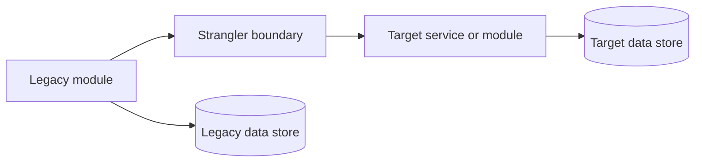

<!-- Generated from harness/github-copilot/prompts/modernize-map.prompt.md by harness/claude-code/scripts/convert_from_copilot.py. Edit the source, not this file. -->

# /modernize-map

## Objective

Map legacy modules to target architecture boundaries by identifying legacy modules, data stores, integrations, business domains, target packages, services, modules, retained components, sequencing, strangler boundaries, data migration checkpoints, and rollback considerations.

## When to Invoke

Use this prompt after `modernize-assess` and preferably after `modernize-extract-rules`, before `modernize-reimagine` finalizes design and before `modernize-transform` starts implementation.

## Preconditions

- The legacy system folder and target architecture direction are available.
- Assessment, brief, and rule artifacts are available when they exist.
- Writing to `analysis/<system>/MAP.md` and a diagram artifact such as `analysis/<system>/MAP.mmd` is permitted.
- The `code-modernization` skill is available.

## Inputs the Team Must Provide

- `target` — the legacy system folder and target architecture to map.
- The system name used for `analysis/<system>/MAP.md` and `analysis/<system>/MAP.mmd`.
- Any existing `analysis/<system>/ASSESSMENT.md`, `analysis/<system>/RULES.md`, or architecture direction.
- Ask the user for anything that is missing; stop if the target architecture boundary is undefined.

## What I Will Do

- Load the `code-modernization` skill before mapping.
- Use the applicable source-analysis skill for legacy structure and use `critical-thinking` to pressure-test material mapping assumptions when useful.
- Identify legacy modules, data stores, integrations, and business domains.
- Map each legacy area to target packages, services, modules, or retained components.
- Define sequencing, strangler boundaries, data migration checkpoints, and rollback considerations.
- Write `analysis/<system>/MAP.md` and a diagram artifact such as `analysis/<system>/MAP.mmd`.

## What I Will NOT Do

- Implement modernized code or change legacy source; `modernize-transform` owns implementation.
- Invent target services, packages, modules, or retained components without evidence or an explicit architecture direction.
- Ignore data flows, rollback considerations, or migration checkpoints when sequencing migration.
- Replace `modernize-reimagine`; this map is the boundary and sequence input for target design.
- Treat the first sequence as final when pressure-testing identifies unresolved risk.

## Output Format

Write `analysis/<system>/MAP.md` and `analysis/<system>/MAP.mmd` with this shape:

```markdown
# Modernization Map — <system>

## Source Scope
- Legacy system folder:
- Target architecture:

## Legacy Areas
| Legacy module or area | Business domain | Data stores | Integrations | Evidence |
| --- | --- | --- | --- | --- |

## Target Mapping
| Legacy area | Target package/service/module | Retain, replace, wrap, or retire | Rationale |
| --- | --- | --- | --- |

## Data Flows
| Flow | Source | Target | Data migration checkpoint | Validation |
| --- | --- | --- | --- | --- |

## Migration Sequence
| Order | Slice | Strangler boundary | Entry criteria | Exit criteria | Rollback consideration |
| --- | --- | --- | --- | --- | --- |

## Risks and Review Notes
- 

## Diagram
- `analysis/<system>/MAP.mmd`
```

Diagram artifact example:



## Definition of Done

- [ ] The `code-modernization` skill was loaded before mapping started.
- [ ] Legacy modules, data stores, integrations, and business domains are identified.
- [ ] Each legacy area maps to target packages, services, modules, or retained components.
- [ ] Sequencing, strangler boundaries, data migration checkpoints, and rollback considerations are defined.
- [ ] `analysis/<system>/MAP.md` exists.
- [ ] A diagram artifact such as `analysis/<system>/MAP.mmd` exists.
- [ ] The response returns only artifact paths, key mapping decisions, validation status, and blockers.

## Prompt Body

Follow these steps in order. Keep the map traceable to source evidence and target architecture constraints.

**Step 1 — Load the modernization workflow.**
Load the `code-modernization` skill and the applicable source-analysis skill. Use `critical-thinking` to pressure-test material mapping assumptions when useful.

**Step 2 — Resolve source and target boundaries.**
Read `${input:target:legacy system folder and target architecture}`. Identify the system name for `analysis/<system>/MAP.md` and `analysis/<system>/MAP.mmd`.

**Step 3 — Identify legacy areas.**
List legacy modules, data stores, integrations, and business domains. Cite assessment and rules artifacts when available.

**Step 4 — Map to target components.**
Map each legacy area to target packages, services, modules, or retained components. Mark whether each area is retained, replaced, wrapped, or retired.

**Step 5 — Define migration sequencing.**
Specify sequencing, strangler boundaries, data migration checkpoints, entry criteria, exit criteria, and rollback considerations for each slice.

**Step 6 — Write the artifacts.**
Write `analysis/<system>/MAP.md` and the diagram artifact `analysis/<system>/MAP.mmd` or another needed diagram artifact.

**Step 7 — Prepare the handoff.**
State which decisions feed `modernize-reimagine` and which slices are candidates for `modernize-transform` after design approval.

**Step 8 — Report concisely.**
Return only artifact paths, key mapping decisions, validation status, and blockers.

## Invocation Example

```
/modernize-map target=legacy system folder and target architecture
```
