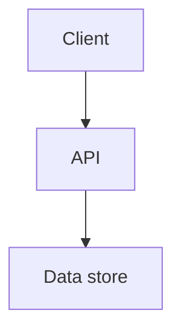

<!-- Generated from harness/github-copilot/plugins/codebase-blueprints/skills/technology-stack-blueprint-generator/SKILL.md by harness/claude-code/scripts/convert_from_copilot.py. Edit the source, not this file. -->

# Technology stack blueprint generator

Analyze a repository and produce a configurable technology blueprint that documents the stack, versions, licenses, usage patterns, conventions, integration points, and implementation rules needed for consistent future code generation.

## When to invoke

- "Generate a technology stack blueprint for this repo."
- "Document our frameworks, dependencies, and coding conventions."
- "Create an implementation-ready architecture technology map."
- "Analyze this .NET, Java, JavaScript, React, or Python stack."
- "Produce a stack diagram and dependency flow for guided development."

## Inputs

Use `$ARGUMENTS` to capture configuration overrides. Defaults are `PROJECT_TYPE="Auto-detect"`, `DEPTH_LEVEL="Standard"`, `INCLUDE_VERSIONS=true`, `INCLUDE_LICENSES=false`, `INCLUDE_DIAGRAMS=true`, `INCLUDE_USAGE_PATTERNS=true`, `INCLUDE_CONVENTIONS=true`, `OUTPUT_FORMAT="Markdown"`, and `CATEGORIZATION="Technology Type"`.

## Configuration model

| Variable | Allowed values | Effect |
| --- | --- | --- |
| `PROJECT_TYPE` | `Auto-detect`, `.NET`, `Java`, `JavaScript`, `React.js`, `React Native`, `Angular`, `Python`, `Other` | Selects the primary analysis lens. |
| `DEPTH_LEVEL` | `Basic`, `Standard`, `Comprehensive`, `Implementation-Ready` | Controls whether the result is inventory-only, convention-rich, or ready for new feature scaffolding. |
| `INCLUDE_VERSIONS` | `true`, `false` | Extracts precise version information from package and configuration files. |
| `INCLUDE_LICENSES` | `true`, `false` | Adds dependency license information when available from manifests or lockfiles. |
| `INCLUDE_DIAGRAMS` | `true`, `false` | Generates stack, dependency flow, component relationship, and data flow diagrams. |
| `INCLUDE_USAGE_PATTERNS` | `true`, `false` | Extracts representative code examples and usage patterns. |
| `INCLUDE_CONVENTIONS` | `true`, `false` | Documents naming, organization, error handling, logging, configuration, validation, and testing conventions. |
| `OUTPUT_FORMAT` | `Markdown`, `JSON`, `YAML`, `HTML` | Selects the output artifact format. |
| `CATEGORIZATION` | `Technology Type`, `Layer`, `Purpose` | Controls grouping in the blueprint. |

## Procedure

1. Identify technologies by scanning project files, configuration files, file extensions, dependency manifests, build scripts, and pipeline definitions.
2. Extract versions when `INCLUDE_VERSIONS=true` and licenses when `INCLUDE_LICENSES=true`.
3. Analyze each detected stack using the stack-specific criteria below.
4. Document implementation patterns and conventions when `INCLUDE_CONVENTIONS=true`.
5. Extract representative code examples when `INCLUDE_USAGE_PATTERNS=true`.
6. Create a technology stack map for `Comprehensive` and `Implementation-Ready` depth.
7. Add implementation blueprints, file/class templates, code snippets, integration points, testing requirements, and documentation requirements for `Implementation-Ready` depth.
8. Add diagrams when `INCLUDE_DIAGRAMS=true`.
9. Save the output as `Technology_Stack_Blueprint.md`, `Technology_Stack_Blueprint.json`, `Technology_Stack_Blueprint.yaml`, or `Technology_Stack_Blueprint.html` based on `OUTPUT_FORMAT`.

## Stack analysis checklist

| Stack | Inspect |
| --- | --- |
| .NET | Target frameworks, language versions, NuGet packages, project structure, `appsettings.json`, `IOptions`, Identity, JWT, REST, GraphQL, minimal APIs, EF Core, Dapper, dependency injection, middleware pipeline, Scoped/Singleton/Transient registrations, controllers, filters, route attributes, ORM configuration, relationship definitions. |
| Java | JDK version, Maven/Gradle dependencies, package structure, Spring Boot configuration, annotations, dependency injection, JPA, JDBC, Spring MVC, JAX-RS. |
| JavaScript | ECMAScript version, transpiler settings, npm dependencies, ESM, CommonJS, webpack, Vite, TypeScript, test framework patterns. |
| React.js | React version, hooks versus class components, Context, Redux, Zustand, Material-UI, Chakra, routing, forms, API integration, component testing, props interfaces, `useState`, `useEffect`, custom hooks, selectors, CSS modules, styled-components, themes, responsive design. |
| Python | Python version, package dependencies, virtual environment setup, Django, Flask, FastAPI, ORM usage, project structure, API patterns. |

## Implementation patterns

When `INCLUDE_CONVENTIONS=true`, document these categories:

| Category | Required observations |
| --- | --- |
| Naming conventions | Class/type, method/function, variable, file naming, interface/abstract class patterns. |
| Code organization | Folder hierarchy, component boundaries, module boundaries, separation of responsibility. |
| Common patterns | Error handling, logging, configuration access, authentication, authorization, validation, and testing. |
| API examples | Controller/endpoint implementation, request DTO, response formatting, validation, error handling. |
| Data access examples | Repository pattern, entity/model definitions, query patterns, transaction handling. |
| Service layer examples | Business logic organization, cross-cutting concerns, dependency injection usage. |
| UI component examples | Component structure, state management, event handling, API integration. |

## Technology stack map

For `Comprehensive` and `Implementation-Ready`, include:

| Area | Include |
| --- | --- |
| Core Framework Usage | Primary frameworks, project-specific configuration, customizations, extension points. |
| Integration Points | How technology components integrate, authentication flow, frontend/backend data flow, third-party service integrations. |
| Development Tooling | IDE settings, code analysis tools, linters, formatters, build pipeline, deployment pipeline, testing frameworks. |
| Infrastructure | Deployment environment, containers, cloud services, monitoring, logging. |
| Technology Decision Context | Apparent reasons for choices, legacy or deprecated technologies, constraints, boundaries, upgrade paths, compatibility considerations. |

## Blueprint for new code

For `DEPTH_LEVEL="Implementation-Ready"`, include file/class templates, ready-to-use code snippets, end-to-end implementation checklists, integration points, testing requirements, and documentation requirements. Keep examples extracted from the repository's real patterns, not generic framework samples.

## Blueprint terminology

Keep implementation-ready blueprint labels exact when they appear in source evidence: `Authentication/authorization`, `Component/module`, `Entity/model`, `File/Class`, `Interface/abstract`, `Method/function`, `controller/endpoint`, `to-use`, and `version-dependent`.

## Output template

```markdown
## Technology stack blueprint

**Status:** complete | partial | blocked
**Project type:** `PROJECT_TYPE=<value>`
**Depth:** `DEPTH_LEVEL=<value>`
**Output:** `Technology_Stack_Blueprint.<extension>`

### Technology inventory
| Layer or category | Technology | Version | License | Purpose | Evidence |
| --- | --- | --- | --- | --- | --- |
| `<layer>` | `<technology>` | `<version or unknown>` | `<license or not checked>` | `<purpose>` | `<file>` |

### Implementation patterns
| Pattern | Current convention | Evidence | Rule for new code |
| --- | --- | --- | --- |
| `<pattern>` | `<observed convention>` | `<file>` | `<instruction>` |

### Integration map


### New-code blueprint
- File/class templates: `<summary>`
- Testing requirements: `<commands and patterns>`
- Documentation requirements: `<rules>`

### Validation
- Versions included: `INCLUDE_VERSIONS=<true|false>`
- Licenses included: `INCLUDE_LICENSES=<true|false>`
- Diagrams included: `INCLUDE_DIAGRAMS=<true|false>`
- Usage patterns included: `INCLUDE_USAGE_PATTERNS=<true|false>`
- Conventions included: `INCLUDE_CONVENTIONS=<true|false>`
```

## Quality gate

- [ ] `PROJECT_TYPE`, `DEPTH_LEVEL`, `OUTPUT_FORMAT`, and `CATEGORIZATION` are stated.
- [ ] Every technology is backed by a file, dependency manifest, configuration file, or source example.
- [ ] Versions and licenses are included or explicitly skipped according to `INCLUDE_VERSIONS` and `INCLUDE_LICENSES`.
- [ ] Usage patterns and conventions are repository-specific when `INCLUDE_USAGE_PATTERNS` and `INCLUDE_CONVENTIONS` are true.
- [ ] Diagrams are included only when `INCLUDE_DIAGRAMS=true` and match the documented stack.
- [ ] The artifact is saved with the correct `Technology_Stack_Blueprint` extension for `OUTPUT_FORMAT`.
