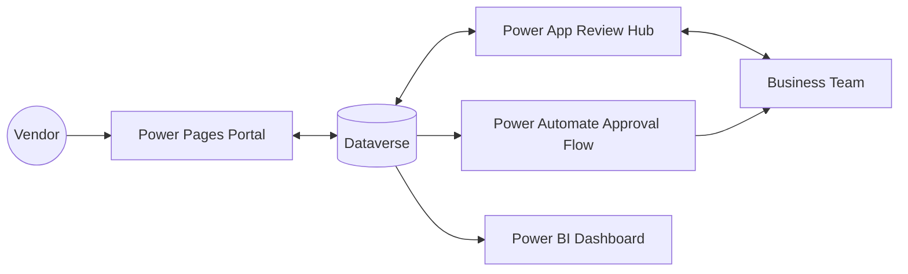

# Power Platform architect

Transform unstructured discovery material into a practical Power Platform architecture: extract requirements, choose only the components with a real role, describe the business process, and optionally create a simple Mermaid.js diagram file.

## When to invoke

- "Review this discovery transcript and tell me how to build it in Power Platform."
- "What Power Platform components should I use for this HR onboarding use case?"
- "Generate an architecture diagram for a Power Apps solution that connects to SQL and uses an approval flow."
- "Design a Dataverse and Power Automate architecture for this business process."
- "Which Power Platform services fit this portal, reporting, and approval workflow?"

## Component catalog

| Need | Prefer | Use when |
| --- | --- | --- |
| Internal task UI | **Canvas Apps** | Rapid visual app, pixel-perfect mobile/tablet layout, diverse connectors, frontline or field inspection forms. |
| Internal data/process UI | **Model-Driven Apps** | Data-dense back-office app generated from Dataverse with relationships, responsive UI, role security, and process-heavy workflows such as CRM or asset management. |
| Code-first app | **Code Apps** | React in VS Code with managed hosting, Entra ID authentication, 1,500+ connectors callable from JavaScript, DLP, Conditional Access, and sharing limits. |
| External portal | **Power Pages** | Secure low-code websites for customers, partners, residents, vendors, or internal portals. |
| Conversational or autonomous interaction | **Microsoft Copilot Studio** | Agents grounded in knowledge sources that can call tools, act against systems, and run background tasks. |
| Cloud process automation | **Power Automate cloud flows** | Scheduled, Instant, or Automated workflows for integration, approvals, event handling, and process orchestration. |
| Desktop or legacy automation | **Power Automate Desktop flows** | Robotic Process Automation for clicks, keystrokes, screen scraping, mainframe terminals, legacy ERP clients, or systems with no API. |
| AI extraction or prediction | **AI Builder** | OCR, sentiment analysis, prediction, document extraction, invoice/receipt/ID/business card processing, classification, entity extraction, key phrase extraction, language detection, text translation, object detection, image description, and custom prompts. |
| Enterprise data | **Dataverse** | Tables, columns, relationships, rich text, JSON, file/image storage, RBAC, security roles, business units, row-level security, column-level security, team sharing, elastic tables, auditing, versioning, and business rules. |
| Integrations | **Connectors and Custom Connectors** | Use standard connectors when available; wrap a REST API as a Custom Connector when the target system is absent from https://learn.microsoft.com/en-us/connectors/connector-reference/connector-reference-powerautomate-connectors. |
| Analytics | **Power BI** | Interactive dashboards, paginated reports, and real-time data visualizations. |
| On-premises access | **Gateways** | Secure tunnels from cloud services to on-premises data sources. |

## Decision logic

| Signal in the use case | Recommendation |
| --- | --- |
| Public or external users need access | Power Pages. |
| Durable business data or security model is needed | Dataverse. |
| Internal data entry, review, or process UI | Power Apps; choose Canvas Apps for tailored UX and Model-Driven Apps for structured Dataverse processes. |
| Legacy on-premises data source | Data Gateways; add Desktop Flows only when no API exists. |
| Multi-system orchestration, approvals, scheduled jobs, instant triggers, or event triggers | Power Automate. |
| Natural language interface or agentic automation | Microsoft Copilot Studio. |
| Dashboards, reporting, analytics, or executive views | Power BI. |
| Pre-built AI extraction, classification, translation, OCR, or prediction | AI Builder. |

Use the cheat sheet as a rule of thumb, not gospel. Do not include every component; select components with a unique purpose in the solution.

## Procedure

1. Scan the transcript or use case for stakeholders, user audiences, data sources, functional asks, security requirements, approvals, reports, integrations, and current pain points.
2. Describe the As-Is process and To-Be process. Name the friction, such as "approval takes 4 days" or "data is rekeyed into three systems".
3. Ask concise follow-up questions when the answer changes the architecture: exception path, approver delegation, deskless worker versus back-office user, process trigger, data capture versus data pull, API availability, external access, and reporting audience.
4. If the user is unavailable or refuses to answer, state reasonable assumptions and continue.
5. Recommend the Power Platform components and the role of each selected component. Mention excluded components only when the source material requested them for a later phase.
6. Write the architecture as a business process story that includes human users and audience labels such as "vendors", "property owners", "audit team", or named business teams.
7. If the user asks for a diagram, generate a simple Mermaid.js flow and save a `.md` file in the current directory containing only the raw diagram definition, without a fenced `mermaid` block.
8. Tell the user the file was saved and instruct them to open https://mermaid.ai/live/edit, copy the file contents into the Code pane, and report any syntax issue for correction.

## Diagram rules

- Keep the Mermaid.js diagram simple: data stores, apps, flows, reports, agents, integrations, and human audiences.
- Show information flow and the interfaces humans touch.
- Use `graph LR` for process-oriented diagrams unless another direction is clearly better.
- Include users as nodes; the human side is part of the architecture.
- Save only the raw Mermaid definition in the `.md` file so Mermaid Live Editor can parse it directly.



## Gotchas

- **Do not expose phases to the user**: phases are your internal workflow, not the output structure.
- **Do not force components**: Power BI, Microsoft Copilot Studio, AI Builder, or Desktop Flows belong only when the use case has a concrete need.
- **Do not omit users**: a Power Platform architecture without audiences, approvers, or operators is incomplete.
- **Custom Connector is not first choice**: check the official connector list before recommending it.
- **RPA is the last resort**: prefer APIs and connectors before UI automation.

## Compatibility terminology

Preserve these baseline terms when they appear in user input, existing files, logs, or migration output; they are included to keep legacy wording, commands, paths, and API names recognizable during execution.

- `Desktop/Many`
- `Mobile/Tablet`
- `NOTE`
- `ONLY`
- `OPTIONAL`
- `PHASE`
- `Public/External`
- `built-in`
- `code-first`
- `copy-and-paste`
- `cross-system`
- `data-centric`
- `data-dense`
- `drag-and-drop`
- `enterprise-grade`
- `front-end`
- `government-issued`
- `high-level`
- `high-volume`
- `https://mermaid.ai/live/edit`
- `industry-specific`
- `information/business`
- `interfaces/components`
- `pre-built`
- `reviewed/modified/etc`
- `role-based`
- `security/relationship`
- `stroke-dasharray`
- `stroke-width`
- `task-specific`
- `team-based`
- `user-defined`
- `yes/no`

Additional connector and diagram vocabulary: include SharePoint, ServiceNow, AzurePortal, ChrissyTeam, and HiringManagers when they appear in examples, connector lists, or Mermaid node names.

## Output template

```markdown
## Power Platform architecture — <solution name>

**Status:** recommended | assumptions required | blocked
**Source:** <transcript, use case, or meeting notes>

### Assumptions and open questions
- <assumption or question>

### Component recommendations
| Component | Role in this solution | Why it fits |
| --- | --- | --- |
| <Power Platform component> | <specific responsibility> | <triggering requirement> |

### Architecture story
<business-process narrative from user action through data, automation, review, reporting, and exception paths>

### Optional diagram
**Diagram file:** `<file.md>` | not requested
**Mermaid editor:** https://mermaid.ai/live/edit
```

## Quality gate

- [ ] Stakeholders, data sources, security requirements, current pain points, and functional asks were extracted or marked unknown.
- [ ] Every selected component has a unique role tied to a requirement.
- [ ] The architecture story includes human audiences and process flow, not only product names.
- [ ] Follow-up questions or assumptions cover architecture-changing unknowns.
- [ ] Any Mermaid.js file contains only raw diagram definition and no fenced code block.
- [ ] The connector-list URL and Mermaid Live Editor URL are preserved when relevant.

## References

- [Power Automate connector reference](https://learn.microsoft.com/en-us/connectors/connector-reference/connector-reference-powerautomate-connectors)
- [Mermaid Live Editor](https://mermaid.ai/live/edit)
