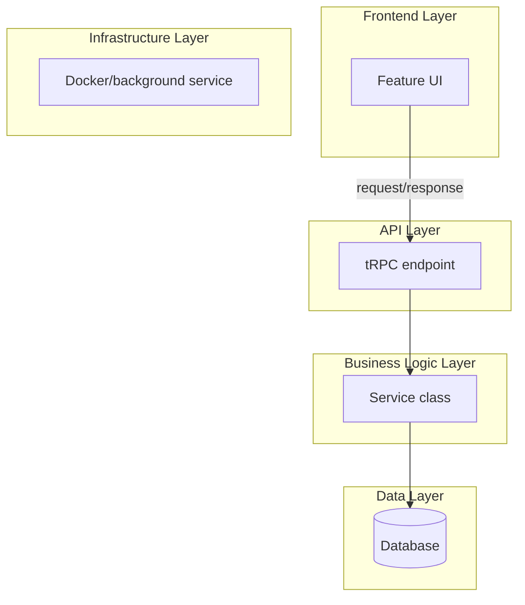
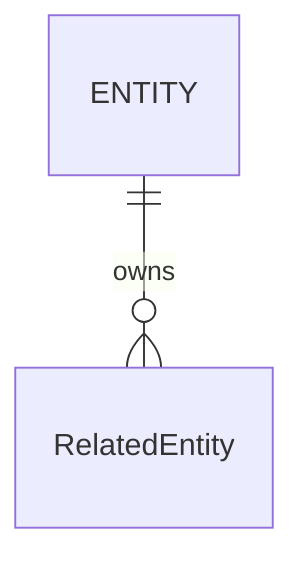

<!-- Generated from harness/github-copilot/plugins/project-planning/skills/breakdown-feature-implementation/SKILL.md by harness/claude-code/scripts/convert_from_copilot.py. Edit the source, not this file. -->

# Feature implementation breakdown

Transform a Feature PRD into a comprehensive Markdown implementation plan for a large-scale SaaS feature, using industry-veteran judgment for high-touch front-end and back-end work, pseudocode only when needed, and saving or presenting the plan at `/docs/ways-of-work/plan/{epic-name}/{feature-name}/implementation-plan.md`.

## When to invoke

- "Create an implementation plan from this Feature PRD."
- "Break down this feature for engineering."
- "Generate `/docs/ways-of-work/plan/{epic-name}/{feature-name}/implementation-plan.md`."
- "Plan the frontend, backend, database, and rollout for this feature."
- "Turn this PRD into an Epoch monorepo implementation plan."

## Inputs

Use `$ARGUMENTS` as the feature name, epic name, or PRD path when provided. If `$ARGUMENTS` is empty, infer `{epic-name}` and `{feature-name}` from the Feature PRD title and ask only if the destination path would be ambiguous. Treat the Feature PRD content as the source of truth.

## Planning scope

| Area | Required content |
| --- | --- |
| Goal | Describe the feature goal in 3-5 sentences. |
| Requirements | Preserve detailed feature requirements and implementation specifics from the PRD. |
| File system | Map work into `apps/[app-name]/`, `services/[service-name]/`, and `packages/[package-name]/`. |
| Architecture | Include a Mermaid system architecture diagram with frontend, API, business logic, data, and infrastructure layers. |
| Database | Include a Mermaid entity-relationship diagram, table specifications, constraints, indexes, foreign keys, and migration strategy. |
| API | Define endpoints, request/response TypeScript types, tRPC routes when applicable, authentication, authorization, validation, status codes, rate limiting, and caching. |
| Frontend | Define component hierarchy, state flow, reusable components, Zustand/React Query patterns, and TypeScript interfaces. |
| Security performance | Cover authentication/authorization, data validation, sanitization, caching, and performance optimization. |
| Deployment | Explain Docker containerization, background services, environment rollout, and scalability. |

## Epoch monorepo placement

Use the monorepo tree literally when planning files. Assign each artifact to the narrowest owning package or service.

```text
apps/
  [app-name]/
services/
  [service-name]/
packages/
  [package-name]/
```

| Location | Put here |
| --- | --- |
| `apps/[app-name]/` | UI routes, page components, client state, shadcn/ui composition, and app-specific React Query hooks. |
| `services/[service-name]/` | tRPC endpoints, service classes, workflow orchestration, background jobs, and external API integrations. |
| `packages/[package-name]/` | Shared types, validation schemas, design-system wrappers, domain utilities, and reusable clients. |

## Architecture diagram requirements

Create a Mermaid diagram using subgraphs for these layers:

| Layer | Include |
| --- | --- |
| Frontend Layer | User interface components, state management, and client-side logic. |
| API Layer | tRPC endpoints, authentication middleware, input validation, and request routing. |
| Business Logic Layer | Service classes, business rules, workflow orchestration, and event handling. |
| Data Layer | Database interactions, caching mechanisms, and external API integrations. |
| Infrastructure Layer | Docker containers, background services, and deployment components. |

Label arrows with request/response patterns, data transformations, events, and feature-specific flows.

## Frontend architecture patterns

Use `shadcn/ui` as the accessible component foundation when the PRD needs UI. Adapt the example hierarchy to the actual feature rather than copying recipe-specific names unless the feature is a recipe library.

```text
Recipe Library Page
├── Header Section (shadcn: Card)
│   ├── Title (shadcn: Typography `h1`)
│   ├── Add Recipe Button (shadcn: Button with DropdownMenu)
│   │   ├── Manual Entry (DropdownMenuItem)
│   │   ├── Import from URL (DropdownMenuItem)
│   │   └── Import from PDF (DropdownMenuItem)
│   └── Search Input (shadcn: Input with icon)
├── Main Content Area (flex container)
│   ├── Filter Sidebar (aside)
│   │   ├── Filter Title (shadcn: Typography `h4`)
│   │   ├── Category Filters (shadcn: Checkbox group)
│   │   ├── Cuisine Filters (shadcn: Checkbox group)
│   │   └── Difficulty Filters (shadcn: RadioGroup)
│   └── Recipe Grid (main)
│       └── Recipe Card (shadcn: Card)
│           ├── Recipe Image (img)
│           ├── Recipe Title (shadcn: Typography `h3`)
│           ├── Recipe Tags (shadcn: Badge)
│           └── Quick Actions (shadcn: Button - View, Edit)
```

| Topic | Planning rule |
| --- | --- |
| State flow | Include a Mermaid state flow diagram; separate server cache, client UI state, and form state. |
| Component hierarchy | Name containers, presentational components, forms, empty states, loading states, and error states. |
| TypeScript | Show interfaces and types for request, response, entity, form, and view model shapes. |
| Data fetching | Use React Query for server state and Zustand for cross-component client state only when needed. |
| Accessibility | Include keyboard behavior, focus states, labels, and semantic elements for interactive flows. |

## API and data design

| Subject | Required detail |
| --- | --- |
| Endpoints | Full endpoint specifications, including tRPC procedure names when used. |
| Request/response | TypeScript types, validation constraints, and representative examples. |
| Auth | Stack Auth authentication and authorization checks at the boundary. |
| Errors | Status codes, error shape, retryability, and user-visible message rules. |
| Data model | Entity fields, types, nullability, defaults, constraints, foreign keys, and indexes. |
| Migrations | Version-controlled migration order and rollback approach. |
| Caching | What is cached, invalidation triggers, and stale data tolerance. |

## Limits

- Do not write production code in the plan. Use pseudocode only for technical situations where prose would be ambiguous.
- Do not invent requirements not supported by the Feature PRD; mark assumptions explicitly.
- Do not omit deployment architecture when Docker containers, background services, or infrastructure dependencies are part of the feature.

## Output template

````markdown
# Implementation Plan: <feature-name>

**Destination:** `/docs/ways-of-work/plan/{epic-name}/{feature-name}/implementation-plan.md`
**Source:** Feature PRD: <title or path>

## Goal
<3-5 sentences describing the feature goal>

## Requirements
- <requirement and implementation-specific detail>

## File System
```text
apps/
  [app-name]/
services/
  [service-name]/
packages/
  [package-name]/
```

## Technical Considerations

### System Architecture Overview


### Database Schema Design


### API Design
| Endpoint | Auth | Request | Response | Errors |
| --- | --- | --- | --- | --- |
| `<endpoint>` | Stack Auth | `<TypeScript type>` | `<TypeScript type>` | `<status codes>` |

### Frontend Architecture
<component hierarchy, state flow diagram, reusable components, Zustand/React Query usage, TypeScript interfaces>

### Security Performance
<authentication, authorization, validation, sanitization, caching, and performance optimization; include Authentication/authorization boundaries explicitly>
````

## Quality gate

- [ ] The output is a Markdown implementation plan and, when writing files, targets `/docs/ways-of-work/plan/{epic-name}/{feature-name}/implementation-plan.md`.
- [ ] The plan includes the `apps/`, `services/`, and `packages/` monorepo structure.
- [ ] The architecture diagram has frontend, API, business logic, data, and infrastructure subgraphs with labeled flows.
- [ ] The database section includes Mermaid ERD, table specifications, indexes, foreign keys, and migration strategy.
- [ ] The API section includes endpoints, TypeScript request/response types, Stack Auth, validation, status codes, rate limiting, and caching.
- [ ] The frontend section includes component hierarchy, shadcn/ui usage, state flow, Zustand/React Query patterns, and TypeScript interfaces.
- [ ] Security, performance, Docker containerization, scalability, and deployment concerns are addressed.
- [ ] No production code is included except necessary pseudocode.
