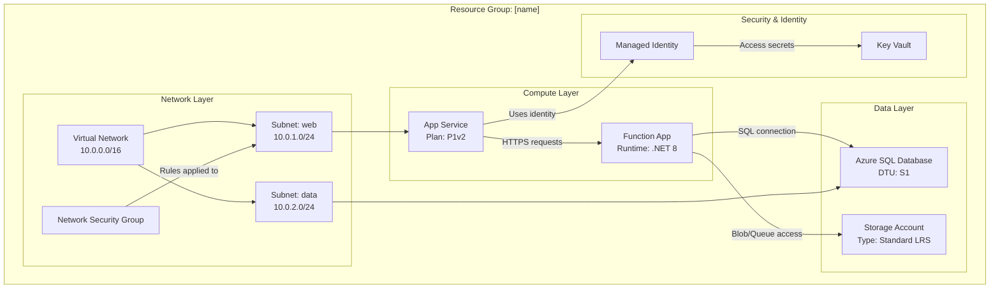

<!-- Generated from harness/github-copilot/skills/azure-resource-visualizer/SKILL.md by harness/claude-code/scripts/convert_from_copilot.py. Edit the source, not this file. -->

# Azure resource visualizer

Inspect an Azure resource group read-only, identify every resource and significant dependency, then create a markdown architecture document with a detailed Mermaid diagram using `assets/template-architecture.md`.

## When to invoke

- "Diagram this Azure resource group."
- "Show how my Azure resources relate to each other."
- "Generate a Mermaid architecture diagram for these resources."
- "Analyze my production resource group."
- "Document the network, compute, data, and identity relationships."

## Prerequisites and context

- Use Azure MCP tools when available; otherwise use Azure CLI `az` for read-only queries.
- The user must have Azure access to list resource groups and read resources.
- Create output in the workspace root or `docs/` when that folder exists.
- Use `assets/template-architecture.md` as the markdown document template.
- Do not modify, delete, deploy, or reconfigure Azure resources.

## Procedure

1. If no resource group is specified, list available resource groups with locations, present a numbered list, and wait for the user to select by number or name.
2. Validate the selected resource group exists.
3. Query all resources in the resource group. With Azure CLI, start with `az resource list --resource-group <name> --output json`.
4. For each resource, collect name, type, SKU or tier, location, key configuration properties, network settings, identity settings, and dependencies.
5. Query resource-specific details where needed, for example `az network vnet show --resource-group <name> --name <vnet-name>`.
6. Map relationships: network connections, data flows, identity access, configuration references, and parent-child dependencies.
7. Build a Mermaid diagram using `graph TB` or `graph LR`, logical subgraphs, detailed labels, and descriptive connection labels.
8. Create `[resource-group-name]-architecture.md` from `assets/template-architecture.md` with header, summary, resource inventory, architecture diagram, relationship details, notes, and recommendations.
9. Report the file path, resource count, relationship count, and any permission gaps.

## Resource analysis checklist

| Area | Capture |
| --- | --- |
| Identity | Managed Identity, RBAC, Key Vault access, role assignments when visible. |
| Network | VNets, subnets, address ranges, NSGs, VNet peering, private endpoints, public access. |
| Compute | App Service plan tier such as `B1`, `S1`, `P1v2`; Function runtime such as `.NET`, Python, or Node. |
| Data | Azure SQL Database tier such as Basic, Standard, Premium; Storage Account redundancy such as `LRS`, `GRS`, `ZRS`. |
| Configuration | App Settings, connection strings, Key Vault references, API Management backends. |
| Dependencies | Parent-child resources, required resources, cross-resource-group dependencies, optional or conditional links. |
| Monitoring | Application Insights, Log Analytics, diagnostic settings, alerting resources. |

## Relationship mapping

| Relationship | Examples | Diagram edge |
| --- | --- | --- |
| Data flow | Apps → Databases, Functions → Storage, API Management → Backends | `-->` |
| Identity | App Service uses Managed Identity to access Key Vault | `-->\|"Uses identity"\|` |
| Network | VNet contains subnet; NSG applies to subnet; private endpoint targets PaaS | `-->` |
| Optional or inferred conditional path | Optional queue trigger or backup dependency | `-.->` |
| Critical primary path | Public ingress to API or required production dependency | `==>` |
| External dependency | Cross-resource-group or external service | Show as external node and note source. |

## Mermaid diagram rules

Use clear node IDs and line breaks with `<br/>`. Group by layer or purpose: Network Layer, Compute Layer, Data Layer, Security & Identity, Monitoring, and Other Resources. Include configuration details that affect architecture.



## Edge cases

| Situation | Response |
| --- | --- |
| No resources found | Inform the user and verify the resource group name. |
| Permission issue | Explain missing read permission and suggest checking RBAC. |
| 50+ resources | Consider multiple diagrams by layer while keeping one inventory. |
| Cross-resource-group dependencies | Include an external node and call out the dependency in notes. |
| No clear relationships | Group in `Other Resources` and explain that no verified dependency was found. |

## Progressive disclosure and bundled resources

- `assets/template-architecture.md`: template for the generated `[resource-group-name]-architecture.md` file.

## Azure query and syntax vocabulary

When using Azure MCP search, preserve these intent strings: `intent="list resource groups"`, `intent="list resources in group"`, and `intent="get resource details"`; use the `command` parameter only for specific Azure operations. `mermaid` syntax may include `subgraph "Descriptive Name"`, `ID["Display Name<br/>Details"]`, and `SOURCE -->|"Label"| TARGET` with `SOURCE` and `TARGET` node IDs. Use `top-to-bottom` for `graph TB`, `left-to-right` for `graph LR`, `critical/primary` for `==>`, and `optional/conditional` for `-.->`. Example resource group names and files include `rg-prod-app`, `rg-dev-app`, `rg-shared`, `[rg-name]-architecture.md`, `rg-prod-app-architecture`, and `rg-prod-app-architecture.md`. Capture `SKU/tier` and `Location/region`, and aim for `architect-level` output.

## Output template

```markdown
### Azure resource visualizer result

**Status:** complete | needs selection | blocked
**Resource group:** `<name>`
**Output file:** `<resource-group-name>-architecture.md`
**Resources analyzed:** <count>
**Relationships mapped:** <count>

| Resource | Type | Location | Key properties | Relationships |
| --- | --- | --- | --- | --- |
| `<name>` | `<type>` | `<region>` | `<sku, runtime, network, identity>` | `<connections>` |

**Diagram**
- Mermaid syntax: valid | needs correction
- Layout: graph TB | graph LR
- Grouping: Network | Compute | Data | Security & Identity | Monitoring | Other

**Notes**
- <permission gaps, external dependencies, or recommendations>
```

## Quality gate

- [ ] Resource group was selected or validated before analysis.
- [ ] All resources returned by the resource group query are included or explicitly explained.
- [ ] Each resource has name, type, location, and key properties captured.
- [ ] Network, data, identity, configuration, and dependency relationships were checked.
- [ ] Mermaid uses valid `graph TB` or `graph LR`, subgraphs, node labels, and descriptive edge labels.
- [ ] The markdown file was created from `assets/template-architecture.md` in the workspace root or `docs/`.
- [ ] No Azure resources were modified.
