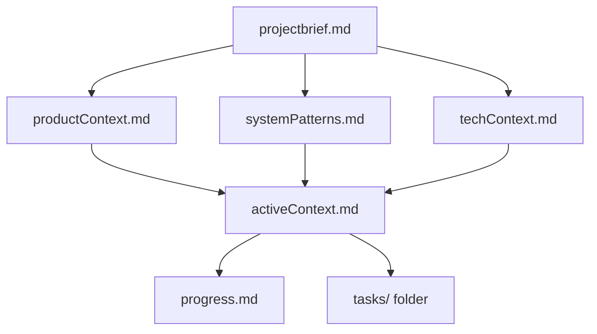

# Memory Bank Conventions — Persistent Project Context

These instructions apply only to repositories that intentionally maintain a `memory-bank/` folder at the workspace root. They are authoritative for the structure, update rules, task files, and project-intelligence notes inside `memory-bank/**`; repository documentation standards, security rules, and user instructions win when they define stricter handling for sensitive information or project records.

## Opt-in Use and Core Contract

Use the Memory Bank only when persistent project documentation across AI sessions is desired. Treat the contents as the agent's durable project context after memory resets: the next session relies entirely on the files to understand the project, active work, decisions, and progress.

- Keep documentation precise and current because stale context misleads future work.
- Read all core Memory Bank files before acting on work that depends on persisted context.
- Update the Memory Bank after significant changes, when discovering new project patterns, when context needs clarification, and when the user requests **update memory bank**.
- When **update memory bank** is requested, review every Memory Bank file, especially `activeContext.md`, `progress.md`, `tasks/`, and `tasks/_index.md`.

## Required Structure

The Memory Bank consists of required Markdown files and optional folders. Preserve this hierarchy:



| File or folder | Required content | Rationale |
| --- | --- | --- |
| `projectbrief.md` | Core requirements, goals, and project scope | It is the foundation and source of truth for all other files |
| `productContext.md` | Why the project exists, problems solved, expected behavior, and user experience goals | Product intent anchors technical decisions |
| `activeContext.md` | Current work focus, recent changes, next steps, active decisions, and considerations | New sessions need the immediate state first |
| `systemPatterns.md` | Architecture, key technical decisions, design patterns, and component relationships | Implementation choices need durable explanation |
| `techContext.md` | Technologies, development setup, technical constraints, and dependencies | Environment assumptions must be discoverable |
| `progress.md` | What works, what remains, current status, and known issues | Future work needs an accurate completion map |
| `tasks/` | One task file per task plus `_index.md` | Task history and status survive session resets |

Create additional files or folders only for useful organization, such as complex feature documentation, integration specifications, API documentation, testing strategies, or deployment procedures.

## Context Update Rules

Memory Bank updates are conventions, not a chat workflow.

- Capture discoveries about critical implementation paths, project-specific patterns, known challenges, evolution of decisions, and tool usage patterns.
- Record user preferences and workflow only when appropriate and safe to persist.
- Keep `activeContext.md`, `progress.md`, and `tasks/` synchronized whenever current work changes.
- Document decisions with enough detail that another agent can continue without asking for the same context.
- Treat instructions-style project intelligence as a living learning journal; validate important new patterns with the user when practical before recording them as durable guidance.

## Task Management Files

Maintain `tasks/_index.md` as the master list of all tasks with IDs, names, statuses, and short notes.

```markdown
# Tasks Index

## In Progress
- [TASK003] Implement user authentication - Working on OAuth integration

## Pending
- [TASK006] Add export functionality - Planned for next sprint

## Completed
- [TASK001] Project setup - Completed on 2025-03-15

## Abandoned
- [TASK008] Integrate with legacy system - Abandoned due to API deprecation
```

Each task file uses `TASKID-taskname.md`, for example `TASK001-implement-login.md`, and preserves the task narrative:

```markdown
# [Task ID] - [Task Name]

**Status:** [Pending/In Progress/Completed/Abandoned]  
**Added:** [Date Added]  
**Updated:** [Date Last Updated]

## Original Request
[The original task description as provided by the user]

## Thought Process
[Discussion and reasoning that shaped the approach]

## Implementation Plan
- [Step 1]
- [Step 2]
- [Step 3]

## Progress Tracking

**Overall Status:** [Not Started/In Progress/Blocked/Completed] - [Completion Percentage]

### Subtasks
| ID | Description | Status | Updated | Notes |
|----|-------------|--------|---------|-------|
| 1.1 | [Subtask description] | [Complete/In Progress/Not Started/Blocked] | [Date] | [Any relevant notes] |

## Progress Log
### [Date]
- Updated subtask 1.1 status to Complete
- Started work on subtask 1.2
- Encountered issue with [specific problem]
- Made decision to [approach/solution]
```

Update both the subtask status table and the progress log when progress occurs. The table provides quick status; the log preserves reasoning, challenges, and decisions.

## Task Commands and Filters

Honor these command phrases when maintaining task records:

| Request | Convention |
| --- | --- |
| **add task** or **create task** | Create a unique task file in `tasks/`, document thought process, add an implementation plan, set initial status, and update `_index.md`. |
| **update task [ID]** | Open the task file, add a progress log entry with today's date, update task status as needed, update `_index.md`, and integrate new decisions into the thought process. |
| **show tasks [filter]** | Display matching tasks with task ID, name, status, completion percentage, last updated date, and next pending subtask when present. |

Valid filters are **all**, **active**, **pending**, **completed**, **blocked**, **recent**, **tag:[tagname]**, and **priority:[level]**.

## Good / Bad Examples

The examples below illustrate task progress updates that preserve resumable context.

**Good:**

```markdown
### 2026-08-17
- Updated subtask 1.2 to Complete after OAuth callback tests passed.
- Decided to keep token refresh in AuthService because the API client already depends on it.
- Next: add integration coverage for expired refresh tokens.
```

Why: The entry records status, evidence, decision rationale, and the next resumable action.

**Bad:**

```markdown
### 2026-08-17
- Worked on auth.
```

Why: The entry does not explain what changed, what remains, or how the next session should continue.

## Workflow Vocabulary

Retain the original Memory Bank command vocabulary: `MUST`, `EVERY`, `ENTIRELY`, and `REMEMBER` mark inherited emphasis in this convention set; `tasks/TASKID-taskname.md`, `files/folders`, `TASK002`, `TASK004`, `TASK005`, and `TASK007` remain valid examples. Mermaid node names such as `ReadFiles`, `CheckFiles`, `NewFile`, `IndexUpdate`, and `StatusChange` are illustrative diagram identifiers, not framework APIs.

## Conventions

| Rule | Rationale |
|---|---|
| Keep `projectbrief.md` as the scope source of truth | Downstream context files need one stable foundation |
| Review every Memory Bank file for **update memory bank** requests | Partial reviews leave stale active context or task state behind |
| Keep `activeContext.md`, `progress.md`, `tasks/`, and `tasks/_index.md` synchronized | Agents resume from both narrative and status views |
| Store each task in `TASKID-taskname.md` and index it in `_index.md` | Task records remain discoverable and individually detailed |
| Update the subtask table and progress log together | Status without narrative loses reasoning; narrative without status slows recovery |
| Capture project intelligence only when it helps future work | The Memory Bank should stay useful rather than becoming a transcript |

## Do / Do Not

| Do | Do not |
|---|---|
| Enable `memory-bank/` only for repositories that need persistent AI context | Add auxiliary files to repos that do not want session carryover |
| Read the core files before relying on persisted context | Act from memory while ignoring the documented project state |
| Record decisions, constraints, and known issues in the right core file | Hide important project context in chat-only notes |
| Use the defined task statuses and filters consistently | Invent status names that make `_index.md` hard to scan |
| Keep optional context files focused on features, integrations, APIs, testing, or deployment | Create miscellaneous files with overlapping ownership |

## Checklist Before Opening a PR

- [ ] `memory-bank/` is intentionally enabled for this repository.
- [ ] `projectbrief.md`, `productContext.md`, `activeContext.md`, `systemPatterns.md`, `techContext.md`, and `progress.md` are present and consistent.
- [ ] `tasks/_index.md` lists every task by status.
- [ ] Each `TASKID-taskname.md` has status, dates, original request, thought process, implementation plan, progress tracking, subtasks, and progress log where applicable.
- [ ] Current work updates appear in both `activeContext.md` and `progress.md`.
- [ ] Task progress changes update both the subtask table and progress log.
- [ ] No sensitive information is stored unnecessarily in persistent context.
