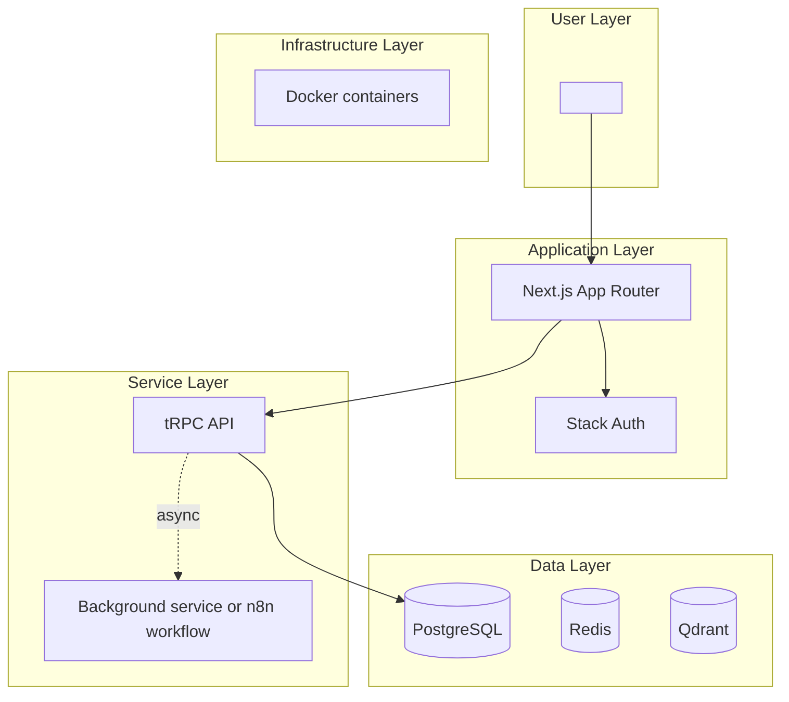

# Epic architecture specification

Transform an Epic PRD into a Markdown architecture specification that identifies the technical approach, system components, deployment shape, feature enablers, stack decisions, technical value, and delivery size without writing implementation code.

## When to invoke

- "Create the architecture spec for this epic PRD."
- "Turn this Epic PRD into `/docs/ways-of-work/plan/{epic-name}/arch.md`."
- "Design the high-level architecture for this SaaS epic."
- "Produce an epic architecture diagram and technical enablers."

## Architecture context to preserve

| Input or assumption | Required treatment |
| --- | --- |
| Epic PRD | Treat it as the source of truth for goals, users, scope, and requirements. Call out gaps instead of inventing facts. |
| Domain-driven architecture | Decompose by bounded context, capability, and module, not by generic layer names alone. |
| Self-hosted and SaaS deployment | Explain whether each component works in both modes and what changes across tenants, networking, storage, and operations. |
| Docker containerization | Model every deployable service as a container or explicitly justify why it is not containerized. |
| TypeScript/Next.js stack with App Router | Place UI routes, server actions, API boundaries, and rendering responsibilities in the architecture; preserve the original **TypeScript/Next.js** stack shorthand where useful. |
| Turborepo monorepo patterns | Show package boundaries, shared libraries, app packages, build orchestration, and dependency direction. |
| tRPC | Use for type-safe internal API contracts when the epic needs app-to-server calls. |
| Stack Auth | Put authentication and session/identity boundaries in the application layer. |
| n8n | Include workflow engines only when asynchronous orchestration is part of the epic. |
| PostgreSQL, Qdrant, Redis | Use PostgreSQL for relational state, Qdrant for vector search, and Redis for cache/queues only when the PRD justifies them. |

Do not write production code. Include pseudocode only when a technical situation cannot be explained clearly with prose, tables, or diagrams.

## Specification sections

| Section | Content to produce | Quality bar |
| --- | --- | --- |
| Epic Architecture Overview | One concise summary of the technical approach. | Names the dominant pattern, main components, and deployment model. |
| System Architecture Diagram | A Mermaid diagram with User, Application, Service, Data, and Infrastructure layers. | Shows synchronous request paths and asynchronous processing flows where relevant. |
| High-Level Features & Technical Enablers | Feature list plus enablers such as services, libraries, queues, schemas, and infrastructure. | Each enabler maps to at least one PRD requirement. |
| Technology Stack | Key technologies, frameworks, and libraries. | Distinguishes mandated stack from optional or conditional choices. |
| Technical Value | High, Medium, or Low with justification. | Ties value to scalability, maintainability, reliability, or speed of delivery. |
| T-Shirt Size Estimate | S, M, L, or XL. | Includes the primary size drivers and uncertainty. |

## Diagram rules

Create one comprehensive Mermaid diagram. Use subgraphs for these layers:

| Layer | Include |
| --- | --- |
| User Layer | Web browsers, mobile apps, admin interfaces, and other user types from the PRD. |
| Application Layer | Load balancers, Next.js application instances, Stack Auth, and edge/application boundaries. |
| Service Layer | tRPC APIs, background services, n8n workflow engines, and epic-specific services. |
| Data Layer | PostgreSQL, Qdrant, Redis, object stores, analytics stores, and external API integrations. |
| Infrastructure Layer | Docker containers, deployment targets, networking, monitoring, and environment boundaries. |

Apply consistent labels for component types. Show data flow direction, distinguish sync calls from async events or jobs, and avoid decorative nodes that do not affect the design.

## Output template

````markdown
# <Epic Name> Architecture Specification

## 1. Epic Architecture Overview
<technical approach summary>

## 2. System Architecture Diagram


## 3. High-Level Features & Technical Enablers
### Features
- <feature>

### Technical enablers
- <enabler> — supports <requirement>

## 4. Technology Stack
| Area | Choice | Rationale |
| --- | --- | --- |
| <area> | <technology> | <reason> |

## 5. Technical Value
**Value:** High | Medium | Low
**Justification:** <why>

## 6. T-Shirt Size Estimate
**Size:** S | M | L | XL
**Drivers:** <complexity drivers>
````

## Quality gate

- [ ] The output is suitable for `/docs/ways-of-work/plan/{epic-name}/arch.md`.
- [ ] Every major architecture decision traces back to the Epic PRD or is marked as an assumption.
- [ ] The Mermaid diagram includes User, Application, Service, Data, and Infrastructure layers.
- [ ] Stack Auth, Docker containerization, TypeScript/Next.js App Router, Turborepo, and tRPC are addressed when applicable.
- [ ] Self-hosted and SaaS deployment implications are explicit.
- [ ] No implementation code is included except necessary pseudocode.
- [ ] Technical value and t-shirt size are stated with justification.
