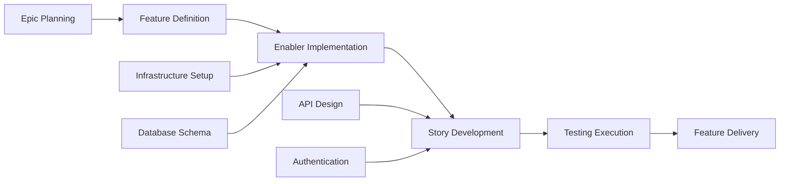

# GitHub issue planning and project automation

Transform PRD, UX, technical, implementation, and testing artifacts into a traceable GitHub project plan with issue templates, dependency mapping, priority labels, sprint planning, and DevOps automation guidance.

## When to invoke

- "Break this feature into GitHub issues."
- "Create an Epic > Feature > Story plan for this PRD."
- "Generate a project plan and issues checklist for this feature."
- "Map dependencies, priorities, labels, and estimates for GitHub Projects."
- "Create sprint planning and Kanban tracking for this feature."

## Source artifacts

Use the feature artifacts available in the repository. Expected source paths are:

| Artifact | Path |
| --- | --- |
| Feature PRD | `/docs/ways-of-work/plan/{epic-name}/{feature-name}.md` |
| Technical Breakdown | `/docs/ways-of-work/plan/{epic-name}/{feature-name}/technical-breakdown.md` |
| Implementation Plan | `/docs/ways-of-work/plan/{epic-name}/{feature-name}/implementation-plan.md` |
| Project Plan output | `/docs/ways-of-work/plan/{epic-name}/{feature-name}/project-plan.md` |
| Issue Creation Checklist output | `/docs/ways-of-work/plan/{epic-name}/{feature-name}/issues-checklist.md` |

If the UX design or testing plan is present, use it. If an artifact is absent, proceed with available evidence and mark the gap in the plan.

Adjacent planning primitive names from legacy workflows may appear as `plan-test`, `plan-epic-arch`, or `plan-feature-prd`; treat them as source context labels, not files to link.

## Work item hierarchy

| Level | Purpose | Required content |
| --- | --- | --- |
| Epic | Large business capability spanning multiple features; milestone level | Business value, success metrics, user impact, high-level acceptance criteria, Definition of Done, feature issue links, `epic`, `{priority-level}`, `{value-tier}` labels, milestone, XS/S/M/L/XL/XXL estimate |
| Feature | Deliverable user-facing functionality within an epic | Feature summary, user story links, technical enablers, dependencies, acceptance criteria, Definition of Done, `feature`, `{priority-level}`, `{value-tier}`, `{component-name}` labels, epic link, estimate |
| Story | User-focused requirement that delivers value independently | `As a **{user type}**, I want **{goal}** so that **{benefit}**.`, acceptance criteria, technical tasks, test issues, dependencies, Definition of Done, `user-story`, `{priority-level}`, `frontend/backend/fullstack`, `{component-name}` labels, feature link, 1/2/3/5/8 points |
| Enabler | Technical infrastructure or architectural work supporting stories | Technical requirements, implementation tasks, infrastructure setup, user stories enabled, technical validation, performance benchmarks, `enabler`, `{priority-level}`, `infrastructure/api/database`, `{component-name}` labels |
| Test | Quality assurance work for validating stories and enablers | Unit, integration, E2E, accessibility, performance, acceptance criteria, linked story/enabler |
| Task | Implementation-level work breakdown | Concrete implementation step linked to a story or enabler |

Use placeholder issue references consistently while drafting: `#{epic-issue-number}`, `#{feature-issue-number}`, `#{story-issue-number}`, `#{enabler-issue-number}`, `#{task-issue-number}`, and `#{test-issue-number}`. Preserve milestone placeholders such as `{Release version/date}` until real data exists, and call out any post-release fixes that would violate the Definition of Done.

## Planning principles

| Principle | Apply it by |
| --- | --- |
| INVEST Criteria | Keep stories Independent, Negotiable, Valuable, Estimable, Small, and Testable |
| Definition of Ready | Do not mark work ready until acceptance criteria, dependencies, estimate, and owner expectations are clear |
| Definition of Done | Require code review, tests, documentation, UX/accessibility checks where relevant, and acceptance validation |
| Dependency Management | Identify blocking relationships, prerequisites, related work, parallel work, and the critical path |
| Value-Based Prioritization | Balance business value against effort and release risk |

## Procedure

1. Read the source artifacts and extract feature summary, business value, success criteria, user personas, technical scope, testing requirements, risks, dependencies, and constraints.
2. Create the project overview: feature summary, measurable outcomes/KPIs, key milestones without timelines, and risk assessment with mitigation.
3. Build the hierarchy from Epic to Feature to Story, Enabler, Test, and Task. Keep each story independently valuable and testable.
4. Map dependencies using `Blocks`, `Blocked by`, `Related`, `Prerequisite`, and `Parallel`. Identify the critical path.
5. Assign priorities, value labels, components, estimates, milestones, and project fields.
6. Generate `/docs/ways-of-work/plan/{epic-name}/{feature-name}/project-plan.md` and `/docs/ways-of-work/plan/{epic-name}/{feature-name}/issues-checklist.md`.
7. If sprint-by-sprint output, project board configuration, or GitHub Actions snippets are required, read `references/sprint-planning-template.md` and include its detailed material.

## Project plan structure

Include these sections in `project-plan.md`:

```mermaid
graph TD
    A[Epic: {Epic Name}] --> B[Feature: {Feature Name}]
    B --> C[Story 1: {User Story}]
    B --> D[Story 2: {User Story}]
    B --> E[Enabler 1: {Technical Work}]
    B --> F[Enabler 2: {Infrastructure}]
    C --> G[Task: Frontend Implementation]
    C --> H[Task: API Integration]
    C --> I[Test: E2E Scenarios]
    D --> J[Task: Component Development]
    D --> K[Task: State Management]
    D --> L[Test: Unit Tests]
    E --> M[Task: Database Schema]
    E --> N[Task: Migration Scripts]
    F --> O[Task: CI/CD Pipeline]
    F --> P[Task: Monitoring Setup]
```



| Section | Required content |
| --- | --- |
| Project Overview | Feature Summary, Success Criteria, Key Milestones, Risk Assessment |
| Work Item Hierarchy | Mermaid graph and narrative hierarchy |
| GitHub Issues Breakdown | Epic Issue Template, Feature Issue Template, User Story Issue Template, Technical Enabler Issue Template, Test and Task issue outlines |
| Priority and Value Matrix | Priority, Value, Criteria, Labels |
| Estimation Guidelines | Fibonacci story points and t-shirt sizing |
| Dependency Management | Graph plus dependency type table |
| Sprint Planning | Read bundled reference when sprint-level output is requested |

## Priority, value, and estimates

| Priority | Value | Criteria | Labels |
| --- | --- | --- | --- |
| P0 | High | Critical path, blocking release | `priority-critical`, `value-high` |
| P1 | High | Core functionality, user-facing | `priority-high`, `value-high` |
| P1 | Medium | Core functionality, internal | `priority-high`, `value-medium` |
| P2 | Medium | Important but not blocking | `priority-medium`, `value-medium` |
| P3 | Low | Nice to have, technical debt | `priority-low`, `value-low` |

| Scale | Values |
| --- | --- |
| Story Point Scale (Fibonacci) | `1 point`: simple change, `<4 hours`; `2 points`: small feature, `<1 day`; `3 points`: medium feature, `1-2 days`; `5 points`: large feature, `3-5 days`; `8 points`: complex feature, `1-2 weeks`; `13+ points`: epic-level work, needs breakdown |
| T-Shirt Sizing (Epics/Features) | `XS`: `1-2` story points; `S`: `3-8`; `M`: `8-20`; `L`: `20-40`; `XL`: `40+` and should be broken down |

## Success metrics

| Category | Metrics |
| --- | --- |
| Project Management KPIs | Sprint Predictability `>80%`, Cycle Time `<5 business days`, Lead Time `<2 weeks`, Defect Escape Rate `<5%`, consistent Team Velocity |
| Process Efficiency Metrics | Issue Creation Time `<1 hour`, Dependency Resolution `<24 hours`, Status Update Accuracy `>95%`, Documentation Completeness `100%`, Cross-Team Collaboration `<2 business days` |
| Project Delivery Metrics | Definition of Done Compliance `100%`, Acceptance Criteria Coverage `100%`, Sprint Goal Achievement `>90%`, Stakeholder Satisfaction `>90%`, Planning Accuracy `<10%` variance |

The detailed issues-checklist must cover stories/enablers and issue-creation readiness from end-to-end (`to-end` appears in legacy wording).

## Progressive disclosure and bundled resources

Use bundled resources only when the requested output needs their detail:

- `references/sprint-planning-template.md`: sprint goal format, Kanban column structure, custom fields, GitHub Actions issue creation, automated status updates, and issue creation checklist details.

## Gotchas

- **Do not create untestable stories**: every Story, Enabler, and Test must have acceptance criteria and Definition of Done evidence.
- **Do not hide dependencies in prose**: use `Blocks`, `Blocked by`, `Related`, `Prerequisite`, or `Parallel` so the project board can represent them.
- **Do not put timeline guesses into key milestones** unless the source artifacts provide dates; milestones are deliverable-oriented by default.
- **Do not reference prompt files**: refer to adjacent capabilities by primitive name and type, not by VS Code prompt paths.

## Output template

```markdown
## GitHub project plan result — <epic>/<feature>

**Status:** complete | partial | blocked
**Source artifacts:** <PRD, UX, technical breakdown, implementation plan, testing plan>
**Outputs:**
- `/docs/ways-of-work/plan/{epic-name}/{feature-name}/project-plan.md`
- `/docs/ways-of-work/plan/{epic-name}/{feature-name}/issues-checklist.md`

### Project overview
- **Feature Summary:** <summary>
- **Success Criteria:** <measurable outcomes and KPIs>
- **Key Milestones:** <deliverables>
- **Risk Assessment:** <blockers and mitigations>

### Issue hierarchy
| Type | Title | Parent | Priority | Value | Estimate | Dependencies |
| --- | --- | --- | --- | --- | --- | --- |
| Epic | <title> | - | P0-P3 | High/Medium/Low | XS-XXL | <none/list> |
| Feature | <title> | <epic> | P0-P3 | High/Medium/Low | <size> | <blocks/blocked by> |
| Story | <title> | <feature> | P0-P3 | High/Medium/Low | 1/2/3/5/8 | <dependencies> |
| Enabler | <title> | <feature> | P0-P3 | High/Medium/Low | <points> | <dependencies> |
| Test | <title> | <story/enabler> | P0-P3 | High/Medium/Low | <points> | <dependencies> |

### Validation
- INVEST criteria checked: pass | fail
- Definition of Ready checked: pass | fail
- Definition of Done checked: pass | fail
- Dependency graph checked: pass | fail
- Labels, estimates, milestones, and project fields checked: pass | fail
```

## Quality gate

- [ ] Source artifacts and missing inputs are listed.
- [ ] The hierarchy includes Epic, Feature, Story, Enabler, Test, and Task where applicable.
- [ ] Every story follows INVEST Criteria and contains acceptance criteria, testing requirements, dependencies, and Definition of Done.
- [ ] Priority, value, component, estimate, sprint, assignee, epic, labels, and milestone guidance are present where needed.
- [ ] Dependency types and critical path are explicit.
- [ ] Project Management KPIs, Process Efficiency Metrics, and Project Delivery Metrics are preserved when relevant.
- [ ] Bundled `references/sprint-planning-template.md` is used only when sprint, board, automation, or detailed checklist output is required.
- [ ] The output follows `## Output template` exactly.
