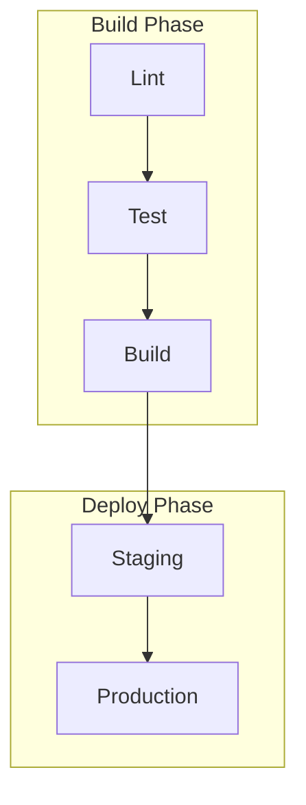
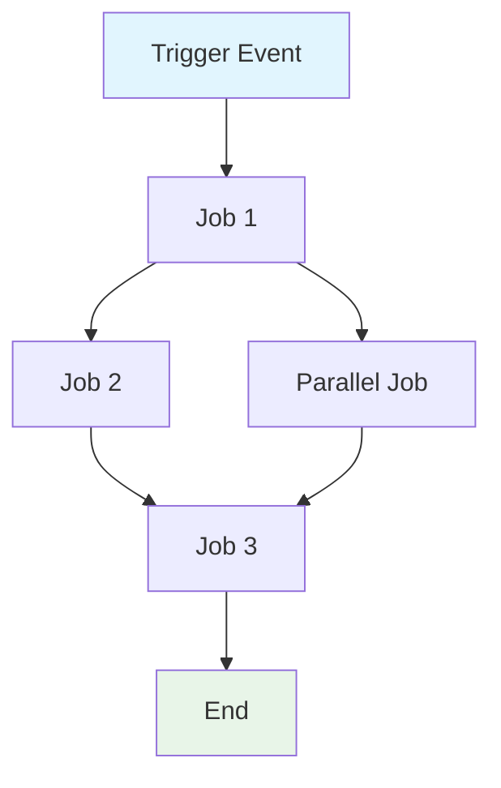

# Create GitHub Actions workflow specification

Analyze an existing GitHub Actions workflow and turn it into an implementation-agnostic specification. Preserve what the workflow accomplishes, the contracts it exposes, the constraints it enforces, and the validation criteria maintainers need.

## When to invoke

- "Create a specification for this GitHub Actions workflow."
- "Document our CI/CD workflow for AI consumption."
- "Generate spec/spec-process-cicd-[workflow-name].md from this YAML."
- "Map the jobs, dependencies, inputs, outputs, and quality gates."
- "Summarize this workflow's behavior without restating every command."

## Inputs

Use `$ARGUMENTS`, `${input:WorkflowFile}`, or the user's request to identify the workflow file. If no file is supplied, look for likely workflow files under `.github/workflows/` and choose the target from the user's context.

## Specification principles

| Principle | Rule |
| --- | --- |
| Token efficiency | Use concise language without sacrificing clarity. |
| Structured data | Prefer tables, lists, diagrams, and compact YAML snippets. |
| Semantic clarity | Use precise terms consistently: trigger, job, gate, artifact, environment, permission, secret, output. |
| Implementation abstraction | Focus on workflow behavior and constraints, not every shell command or tool version. |
| Maintainability | Make updates easy when the workflow evolves. |

## Analysis criteria

| Area | Extract from workflow | Specification output |
| --- | --- | --- |
| Core purpose | Name, comments, trigger context, job intent | One-sentence purpose and target environments. |
| Trigger model | `on`, branches, tags, paths, schedules, workflow_dispatch inputs | Trigger events and input contracts. |
| Job flow | `needs`, matrices, reusable workflows, conditions | Mermaid dependency graph and job table. |
| Contracts | `env`, `vars`, `secrets`, artifacts, cache keys, job outputs | Input/output contracts and secrets table. |
| Constraints | `timeout-minutes`, `concurrency`, permissions, runner labels | Runtime, environment, and access constraints. |
| Quality gates | Tests, scans, approvals, deploy conditions | Gate definitions with bypass rules. |
| Error paths | Failure conditions, `if: failure()`, notifications, rollback steps | Error handling strategy. |
| Governance | Environments, required reviewers, audit logs, change process | Compliance and change management sections. |

## Mermaid diagram rules

| Flow type | Syntax |
| --- | --- |
| Sequential | `A --> B --> C` |
| Parallel | `A --> B & A --> C; B --> D & C --> D` |
| Conditional | `A --> B{Decision}; B -->|Yes| C; B -->|No| D` |

Use these styles when helpful:

```mermaid
style TriggerNode fill:#e1f5fe
style SuccessNode fill:#e8f5e8
style FailureNode fill:#ffebee
style ProcessNode fill:#f3e5f5
```

For workflows with five or more jobs, group phases with subgraphs:



## Procedure

1. Read the target workflow YAML from `.github/workflows/` or the path supplied by the user.
2. Extract the core business objective and target environments.
3. Map trigger events, path filters, branch filters, schedules, manual inputs, and reusable workflow calls.
4. Build the job dependency graph from `needs`, conditions, matrix expansion, and reusable jobs.
5. Identify inputs, outputs, secrets, variables, permissions, artifacts, caches, and external systems.
6. Capture runtime constraints, environmental constraints, quality gates, monitoring expectations, and error handling.
7. Write the specification to `/spec/spec-process-cicd-[workflow-name].md` when editing is requested; otherwise return the markdown content.
8. Keep the specification behavior-focused; do not copy long command bodies unless they define a contract.

## Output template

````markdown
---
title: CI/CD Workflow Specification - [Workflow Name]
version: 1.0
date_created: [YYYY-MM-DD]
last_updated: [YYYY-MM-DD]
owner: DevOps Team
tags: [process, cicd, github-actions, automation, [domain-specific-tags]]
---

## Workflow Overview

**Purpose**: [One sentence describing workflow's primary goal]
**Trigger Events**: [List trigger conditions]
**Target Environments**: [Environment scope]

## Execution Flow Diagram



## Jobs & Dependencies

| Job Name | Purpose | Dependencies | Execution Context |
|----------|---------|--------------|-------------------|
| job-1 | [Purpose] | [Prerequisites] | [Runner/Environment] |
| job-2 | [Purpose] | job-1 | [Runner/Environment] |

## Requirements Matrix

### Functional Requirements
| ID | Requirement | Priority | Acceptance Criteria |
|----|-------------|----------|-------------------|
| REQ-001 | [Requirement] | High | [Testable criteria] |
| REQ-002 | [Requirement] | Medium | [Testable criteria] |

### Security Requirements
| ID | Requirement | Implementation Constraint |
|----|-------------|---------------------------|
| SEC-001 | [Security requirement] | [Constraint description] |

### Performance Requirements
| ID | Metric | Target | Measurement Method |
|----|-------|--------|-------------------|
| PERF-001 | [Metric] | [Target value] | [How measured] |

## Input/Output Contracts

### Inputs

```yaml
# Environment Variables
ENV_VAR_1: string  # Purpose: [description]
ENV_VAR_2: secret  # Purpose: [description]

# Repository Triggers
paths: [list of path filters]
branches: [list of branch patterns]
```

### Outputs

```yaml
# Job Outputs
job_1_output: string  # Description: [purpose]
build_artifact: file  # Description: [content type]
```

### Secrets & Variables

| Type | Name | Purpose | Scope |
|------|------|---------|-------|
| Secret | SECRET_1 | [Purpose] | Workflow |
| Variable | VAR_1 | [Purpose] | Repository |

## Execution Constraints

### Runtime Constraints
- **Timeout**: [Maximum execution time]
- **Concurrency**: [Parallel execution limits]
- **Resource Limits**: [Memory/CPU constraints]

### Environmental Constraints
- **Runner Requirements**: [OS/hardware needs]
- **Network Access**: [External connectivity needs]
- **Permissions**: [Required access levels]

## Error Handling Strategy

| Error Type | Response | Recovery Action |
|------------|----------|-----------------|
| Build Failure | [Response] | [Recovery steps] |
| Test Failure | [Response] | [Recovery steps] |
| Deployment Failure | [Response] | [Recovery steps] |

## Quality Gates

### Gate Definitions
| Gate | Criteria | Bypass Conditions |
|------|----------|-------------------|
| Code Quality | [Standards] | [When allowed] |
| Security Scan | [Thresholds] | [When allowed] |
| Test Coverage | [Percentage] | [When allowed] |

## Monitoring & Observability

### Key Metrics
- **Success Rate**: [Target percentage]
- **Execution Time**: [Target duration]
- **Resource Usage**: [Monitoring approach]

### Alerting
| Condition | Severity | Notification Target |
|-----------|----------|-------------------|
| [Condition] | [Level] | [Who/Where] |

## Integration Points

### External Systems
| System | Integration Type | Data Exchange | SLA Requirements |
|--------|------------------|---------------|------------------|
| [System] | [Type] | [Data format] | [Requirements] |

### Dependent Workflows
| Workflow | Relationship | Trigger Mechanism |
|----------|--------------|-------------------|
| [Workflow] | [Type] | [How triggered] |

## Compliance & Governance

### Audit Requirements
- **Execution Logs**: [Retention policy]
- **Approval Gates**: [Required approvals]
- **Change Control**: [Update process]

### Security Controls
- **Access Control**: [Permission model]
- **Secret Management**: [Rotation policy]
- **Vulnerability Scanning**: [Scan frequency]

## Edge Cases & Exceptions

### Scenario Matrix
| Scenario | Expected Behavior | Validation Method |
|----------|-------------------|-------------------|
| [Edge case] | [Behavior] | [How to verify] |

## Validation Criteria

### Workflow Validation
- **VLD-001**: [Validation rule]
- **VLD-002**: [Validation rule]

### Performance Benchmarks
- **PERF-001**: [Benchmark criteria]
- **PERF-002**: [Benchmark criteria]

## Change Management

### Update Process
1. **Specification Update**: Modify this document first
2. **Review & Approval**: [Approval process]
3. **Implementation**: Apply changes to workflow
4. **Testing**: [Validation approach]
5. **Deployment**: [Release process]

### Version History
| Version | Date | Changes | Author |
|---------|------|---------|--------|
| 1.0 | [Date] | Initial specification | [Author] |

## Related Specifications
- [Link to related workflow specs]
- [Link to infrastructure specs]
````

## Quality gate

- [ ] The target workflow file and generated `/spec/spec-process-cicd-[workflow-name].md` name are identified.
- [ ] Trigger events, target environments, jobs, dependencies, and execution context are captured.
- [ ] Inputs, outputs, secrets, variables, permissions, artifacts, and external integrations are documented.
- [ ] Mermaid diagram syntax represents sequential, parallel, and conditional flow accurately.
- [ ] Requirements, security controls, performance targets, quality gates, and validation criteria are testable.
- [ ] The specification is implementation-agnostic except where syntax defines a contract.
- [ ] Placeholders such as `ENV_VAR_1`, `ENV_VAR_2`, `SECRET_1`, and `VAR_1` are replaced in real deliverables unless intentionally used as template examples.
