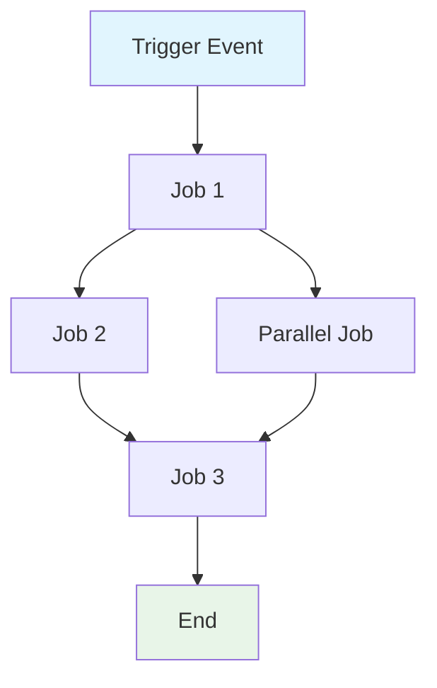

# /create-github-action-workflow-specification

## Objective

Create a comprehensive, AI-ready specification for an existing GitHub Actions workflow `${input:WorkflowFile}` that documents behavior, requirements, constraints, contracts, quality gates, and governance while staying implementation-agnostic about syntax, commands, and tool versions.

## When to Invoke

Use this prompt when a repository has an existing GitHub Actions workflow and the team needs a maintainable specification that describes what the workflow accomplishes and can guide future workflow updates.

## Preconditions

- `${input:WorkflowFile}` identifies an existing GitHub Actions workflow file.
- The workflow can be inspected along with related repository context when needed.
- The destination path `/spec/spec-process-cicd-[workflow-name].md` is acceptable, or the user provides another exact path.
- Editing tools are available when the prompt is expected to save the specification.

## Inputs the Team Must Provide

- `WorkflowFile` — the workflow file to analyze.
- Workflow owner or owning team, defaulting to `DevOps Team` when not supplied.
- Any known domain-specific tags, target environments, SLAs, or compliance constraints.
- Ask the user for anything that is missing, especially when the workflow file path is absent or ambiguous.

## What I Will Do

- Extract the workflow purpose, trigger events, target environments, jobs, dependencies, inputs, outputs, permissions, timeouts, concurrency, and quality gates.
- Create an execution flow diagram with Mermaid.
- Build functional, security, and performance requirements matrices.
- Document secrets, variables, runtime constraints, environmental constraints, error handling, monitoring, observability, integration points, compliance, edge cases, validation criteria, and change management.
- Optimize for token efficiency, structured data, semantic clarity, implementation abstraction, and maintainability.
- Save the specification as `/spec/spec-process-cicd-[workflow-name].md` when edits are allowed.

## What I Will NOT Do

- Rewrite or optimize the GitHub Actions workflow itself.
- Describe implementation syntax, commands, action versions, or tool versions when the specification should be implementation-agnostic.
- Invent triggers, secrets, permissions, jobs, outputs, or SLAs that are not present or provided.
- Create relative links between primitives.
- Skip error paths, edge cases, or validation criteria.
- Write outside the requested specification path.

## Output Format

Create the specification using this template:

````markdown
---
title: CI/CD Workflow Specification - [Workflow Name]
version: 1.0
date_created: [YYYY-MM-DD]
last_updated: [YYYY-MM-DD]
owner: DevOps Team
tags: [process, cicd, github-actions, automation, [domain-specific-tags]]
---

## Workflow Overview

**Purpose**: [One sentence describing workflow's primary goal]
**Trigger Events**: [List trigger conditions]
**Target Environments**: [Environment scope]

## Execution Flow Diagram



## Jobs & Dependencies

| Job Name | Purpose | Dependencies | Execution Context |
|----------|---------|--------------|-------------------|
| job-1 | [Purpose] | [Prerequisites] | [Runner/Environment] |
| job-2 | [Purpose] | job-1 | [Runner/Environment] |

## Requirements Matrix

### Functional Requirements
| ID | Requirement | Priority | Acceptance Criteria |
|----|-------------|----------|-------------------|
| REQ-001 | [Requirement] | High | [Testable criteria] |
| REQ-002 | [Requirement] | Medium | [Testable criteria] |

### Security Requirements
| ID | Requirement | Implementation Constraint |
|----|-------------|---------------------------|
| SEC-001 | [Security requirement] | [Constraint description] |

### Performance Requirements
| ID | Metric | Target | Measurement Method |
|----|-------|--------|-------------------|
| PERF-001 | [Metric] | [Target value] | [How measured] |

## Input/Output Contracts

### Inputs

```yaml
# Environment Variables
ENV_VAR_1: string  # Purpose: [description]
ENV_VAR_2: secret  # Purpose: [description]

# Repository Triggers
paths: [list of path filters]
branches: [list of branch patterns]
```

### Outputs

```yaml
# Job Outputs
job_1_output: string  # Description: [purpose]
build_artifact: file  # Description: [content type]
```

### Secrets & Variables

| Type | Name | Purpose | Scope |
|------|------|---------|-------|
| Secret | SECRET_1 | [Purpose] | Workflow |
| Variable | VAR_1 | [Purpose] | Repository |

## Execution Constraints

### Runtime Constraints
- **Timeout**: [Maximum execution time]
- **Concurrency**: [Parallel execution limits]
- **Resource Limits**: [Memory/CPU constraints]

### Environmental Constraints
- **Runner Requirements**: [OS/hardware needs]
- **Network Access**: [External connectivity needs]
- **Permissions**: [Required access levels]

## Error Handling Strategy

| Error Type | Response | Recovery Action |
|------------|----------|-----------------|
| Build Failure | [Response] | [Recovery steps] |
| Test Failure | [Response] | [Recovery steps] |
| Deployment Failure | [Response] | [Recovery steps] |

## Quality Gates

### Gate Definitions
| Gate | Criteria | Bypass Conditions |
|------|----------|-------------------|
| Code Quality | [Standards] | [When allowed] |
| Security Scan | [Thresholds] | [When allowed] |
| Test Coverage | [Percentage] | [When allowed] |

## Monitoring & Observability

### Key Metrics
- **Success Rate**: [Target percentage]
- **Execution Time**: [Target duration]
- **Resource Usage**: [Monitoring approach]

### Alerting
| Condition | Severity | Notification Target |
|-----------|----------|-------------------|
| [Condition] | [Level] | [Who/Where] |

## Integration Points

### External Systems
| System | Integration Type | Data Exchange | SLA Requirements |
|--------|------------------|---------------|------------------|
| [System] | [Type] | [Data format] | [Requirements] |

### Dependent Workflows
| Workflow | Relationship | Trigger Mechanism |
|----------|--------------|-------------------|
| [Workflow] | [Type] | [How triggered] |

## Compliance & Governance

### Audit Requirements
- **Execution Logs**: [Retention policy]
- **Approval Gates**: [Required approvals]
- **Change Control**: [Update process]

### Security Controls
- **Access Control**: [Permission model]
- **Secret Management**: [Rotation policy]
- **Vulnerability Scanning**: [Scan frequency]

## Edge Cases & Exceptions

### Scenario Matrix
| Scenario | Expected Behavior | Validation Method |
|----------|-------------------|-------------------|
| [Edge case] | [Behavior] | [How to verify] |

## Validation Criteria

### Workflow Validation
- **VLD-001**: [Validation rule]
- **VLD-002**: [Validation rule]

### Performance Benchmarks
- **PERF-001**: [Benchmark criteria]
- **PERF-002**: [Benchmark criteria]

## Change Management

### Update Process
1. **Specification Update**: Modify this document first
2. **Review & Approval**: [Approval process]
3. **Implementation**: Apply changes to workflow
4. **Testing**: [Validation approach]
5. **Deployment**: [Release process]

### Version History
| Version | Date | Changes | Author |
|---------|------|---------|--------|
| 1.0 | [Date] | Initial specification | [Author] |

## Related Specifications
- [Link to related workflow specs]
- [Link to infrastructure specs]
- [Link to deployment specs]
````

## Definition of Done

- [ ] The specification is saved as `/spec/spec-process-cicd-[workflow-name].md` or the requested exact path.
- [ ] The workflow purpose, triggers, jobs, dependencies, inputs, outputs, secrets, variables, permissions, and constraints are documented.
- [ ] Requirements use functional, security, and performance matrices with testable acceptance criteria.
- [ ] Mermaid syntax is valid and covers sequential, parallel, conditional, or subgraph flow as needed.
- [ ] Error paths, quality gates, monitoring, observability, compliance, edge cases, validation, and change management are included.
- [ ] The document avoids implementation-specific syntax, commands, and tool versions except where needed to identify contracts.
- [ ] Unknown or absent facts are labeled instead of invented.

## Prompt Body

Follow these steps in order.

**Step 1 — Load the workflow.**
Open `${input:WorkflowFile}`. Identify the workflow name, primary business objective, trigger conditions, target environments, jobs, and high-level dependencies.

**Step 2 — Apply AI-optimized requirements.**
Use concise language without sacrificing clarity for token efficiency. Use tables, lists, and diagrams for structured data. Use precise terminology consistently for semantic clarity. Avoid specific syntax, commands, or tool versions for implementation abstraction. Design the spec for maintainability and easy updates as the workflow evolves.

**Step 3 — Extract behavior and contracts.**
Map job flow and dependency graph. Document inputs, outputs, interfaces, environment variables, repository triggers, path filters, branch patterns, job outputs, artifacts, secrets, variables, permissions, timeouts, concurrency, memory, CPU, runner requirements, network access, and access levels.

**Step 4 — Define requirements and gates.**
Create functional requirements `REQ-001`, `REQ-002`, security requirements `SEC-001`, and performance requirements `PERF-001` as needed. Identify code quality, security scan, test coverage, validation, approval, and bypass conditions.

**Step 5 — Document errors, monitoring, integrations, and governance.**
Map build failure, test failure, deployment failure, recovery actions, success rate, execution time, resource usage, alerting, external systems, dependent workflows, audit requirements, approval gates, change control, access control, secret management, vulnerability scanning, edge cases, exceptions, and validation criteria such as `VLD-001` and `VLD-002`.

**Step 6 — Generate the Mermaid diagram.**
Use `graph TD`. Represent sequential flow as `A --> B --> C`, parallel flow as `A --> B & A --> C; B --> D & C --> D`, and conditional flow as `A --> B{Decision}; B -->|Yes| C; B -->|No| D`. Use styling such as `style TriggerNode fill:#e1f5fe`, `style SuccessNode fill:#e8f5e8`, `style FailureNode fill:#ffebee`, and `style ProcessNode fill:#f3e5f5`. For workflows with 5+ jobs, use subgraphs such as `subgraph "Build Phase"` and `subgraph "Deploy Phase"`.

**Step 7 — Optimize tokens in the final spec.**
Use tables for dense information. Abbreviate consistently by defining terms once and using them throughout. Prefer bullet points to prose paragraphs. Use code blocks for structured data. Cross-reference rather than repeat information.

**Step 8 — Write and validate the specification.**
Save as `/spec/spec-process-cicd-[workflow-name].md` unless the user supplied another exact path. Ensure the result serves as both documentation and a template for workflow updates. Verify the Definition of Done and report unknowns or assumptions.

## Invocation Example

```
/create-github-action-workflow-specification WorkflowFile=.github/workflows/ci.yml
```
