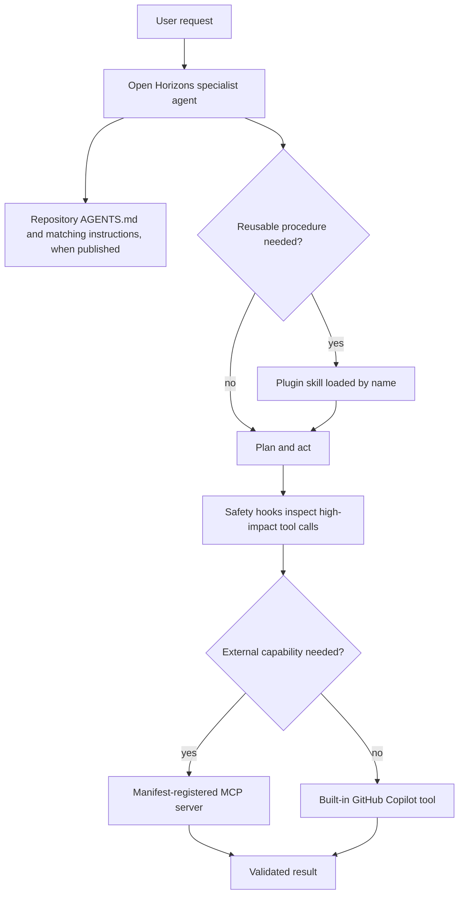

# Open Horizons GitHub Copilot Plugin

This directory packages the Open Horizons agentic DevOps platform customizations for GitHub Copilot. It is both:

1. an installable GitHub Copilot plugin containing agents, skills, hooks, and MCP integrations; and
2. a publishable repository workspace kit containing instructions, prompts, hooks, workflows, issue forms, governance, and authoring references for the Open Horizons source repository.

The package is intentionally self-contained. Its `agents/`, `skills/`, and `hooks/` directories are canonical plugin content, declared through `extensions.com.paulasilvatech.copilot-primitives` in `plugin.json`; the repository component synchronizer must not replace them with unrelated shared-library primitives. For Agent Plugins 1.0 compatibility, the synchronizer mirrors canonical agents and hook configuration into `com.github.copilot/`, which is the extension directory GitHub Copilot CLI loads.

## Supported plugin components

GitHub's plugin documentation, verified on 2026-08-19, lists custom agents, skills, hooks, MCP server configurations, and LSP server configurations as plugin components:

- https://docs.github.com/en/copilot/concepts/agents/about-plugins
- https://docs.github.com/en/copilot/reference/copilot-cli-reference/cli-plugin-reference

This plugin installs the following supported components:

| Package path | Installed behavior |
| --- | --- |
| `plugin.json` | Declares plugin identity, version, the GitHub Copilot agent extension, and repository source ownership metadata. |
| `agents/*.agent.md` | Canonical sources for nine Open Horizons specialist agents. |
| `com.github.copilot/agents/*.agent.md` | Generated Agent Plugins 1.0 runtime copies of the nine agents. |
| `skills/*/SKILL.md` | Installs 30 reusable Open Horizons skills and their bundled resources. |
| `hooks/open-horizons-safety/` | Canonical confirmation hook and deterministic guard script. |
| `com.github.copilot/hooks/hooks.json` | Generated Agent Plugins 1.0 runtime hook configuration. |
| `mcp.json` | Registers four Open Plugin Spec MCP servers: Microsoft Learn, Azure, Terraform, and Playwright. |

The plugin does not currently ship LSP servers. The safety hook asks before destructive infrastructure, cluster, repository, filesystem, or database operations; set `OPEN_HORIZONS_HOOK_MODE=off` to disable it or `audit` to evaluate without requesting confirmation.

MCP prerequisites are explicit: Azure and Playwright require Node.js and `npx`; Terraform requires Docker; Azure operations use the operator's existing Azure authentication context; and Microsoft Learn requires outbound HTTPS. The package embeds no credentials.

## Repository workspace kit

The following files are useful and supported by GitHub Copilot or GitHub after they are published to their repository discovery paths, but the plugin installer does not activate them as plugin components:

| Package path | Publish to | Reader |
| --- | --- | --- |
| `AGENTS.md` | `AGENTS.md` | GitHub Copilot and compatible coding agents. |
| `copilot-instructions.md` | `.github/copilot-instructions.md` | Repository-wide GitHub Copilot instructions. |
| `instructions/*.instructions.md` | `.github/instructions/` | Matching path-specific GitHub Copilot instructions. |
| `prompts/*.prompt.md` | `.github/prompts/` | VS Code prompt files only. |
| `workflows/*.yml` | `.github/workflows/` | GitHub Actions and Copilot coding-agent setup. |
| `ISSUE_TEMPLATE/*` | `.github/ISSUE_TEMPLATE/` | GitHub issue forms and routing metadata. |
| `PULL_REQUEST_TEMPLATE.md` | `.github/PULL_REQUEST_TEMPLATE.md` | Pull request authors. |
| `dependabot.yml` | `.github/dependabot.yml` | Dependabot. |
| `docs/` | `.github/docs/` | Maintainers and customization authors. |
| `model-routing.yaml` | `.github/model-routing.yaml` | Repository convention only; GitHub Copilot does not enforce it. |
| `hooks/open-horizons-safety/` | `hooks/open-horizons-safety/` plus `.github/hooks/open-horizons-safety.json` | Repository-level GitHub Copilot hooks. |
| `skills/open-horizons-workspace-kit/templates/mcp.json` | `.github/mcp.json` | Workspace MCP configuration equivalent to plugin-root Agent Plugins 1.0 MCP servers. |

Prompts are not GitHub Copilot CLI plugin primitives. Instructions are discovered from repository, user, organization, or enterprise instruction locations rather than from a plugin's `instructions/` directory. Keep these assets in the package, but do not claim they become active merely because the plugin is installed. Use the `open-horizons-workspace-kit` skill to preview and publish them safely.

## Installation

Register this repository's marketplace:

```bash
copilot plugin marketplace add paulasilvatech/copilot-primitives
```

Install the plugin:

```bash
copilot plugin install open-horizons-platform@copilot-primitives
```

After installation, use `copilot plugin list`, `copilot skill list --json`, and `copilot mcp list` to confirm discovery. Plugin hooks run in new sessions; publish workspace-kit assets separately only when the target repository needs them.

Preview the complementary workspace kit:

```bash
python3 <installed-plugin>/skills/open-horizons-workspace-kit/scripts/install_workspace_kit.py \
  --target <repository>
```

The command is dry-run by default. Its complete default includes repository agents and skills so the named agents in VS Code prompts resolve without a CLI plugin dependency. Add `--apply` only after reviewing the plan; conflicts block all writes unless an explicit `--force` is approved. Use explicit component groups to omit runtime copies when duplication is not desired.

Plugin agents are namespaced by plugin name. For example:

```bash
copilot --agent open-horizons-platform:deploy
```

## Composition flow



VS Code prompt files are intentionally outside this plugin execution path. A workflow that must run in GitHub Copilot CLI or Copilot coding agent belongs in a skill.

## Tool vocabulary

Agent `tools` is an allow-list. For GitHub Copilot CLI 1.0.81-0, local runtime evidence records `search`, `web`, and `todo` as no-op tokens. This plugin therefore uses concrete CLI capabilities:

| Capability | Token |
| --- | --- |
| Read workspace content | `read` |
| Search text and paths | `grep`, `glob` |
| Edit approved files | `edit` |
| Run commands | `execute` |
| Delegate to another agent | `agent` |
| Use an MCP server | `<server>/*` |

VS Code prompt tool IDs and GitHub Copilot CLI agent tokens are different vocabularies. Do not copy prompt-only tool IDs into agent frontmatter.

## Inventory

| Surface | Count |
| --- | ---: |
| Agents | 9 |
| Skills | 30 |
| Instruction files | 10 |
| VS Code prompts | 9 |
| Workflows | 13 |
| Issue forms | 27 |
| MCP servers | 4 |
| Hook packages | 1 |

The workspace-kit source was compared with `Ohorizons/open-horizons-platform` default branch commit `7858578302fe0f54fdb43e15f84b14fd5d7519c2` on 2026-08-19. Package-specific runtime fixes and repository governance can intentionally diverge from upstream.

## Validation

From this repository root, run:

```bash
python3 library/plugins/open-horizons-platform/skills/validation-scripts/scripts/validate-agents.py --strict
python3 library/scripts/validate_primitives.py --strict --root library/plugins/open-horizons-platform
python3 library/scripts/validate_primitives.py --strict
python3 library/scripts/normalize_plugin_manifests.py --check
python3 library/scripts/audit_plugins.py --check
python3 library/scripts/audit_primitive_content.py --check
python3 library/scripts/generate_catalog.py --check
python3 library/scripts/sync_plugin_components.py --check
python3 library/scripts/sync_installed_primitives.py --check
```

Validate each skill package with the repository `skill-creator` validator after changing it. Run changed bundled scripts directly, validate draw.io assets with `scripts/validate_drawio.py`, and test VS Code prompts with **Chat: Run Prompt** when that runtime is available.

## References

- [Plugin manifest](plugin.json)
- [Root agent guide](AGENTS.md)
- [Package harness specification](docs/COPILOT-HARNESS-SPEC.md)
- [Primitive templates](docs/templates/)
- [Open Horizons upstream](https://github.com/Ohorizons/open-horizons-platform)
